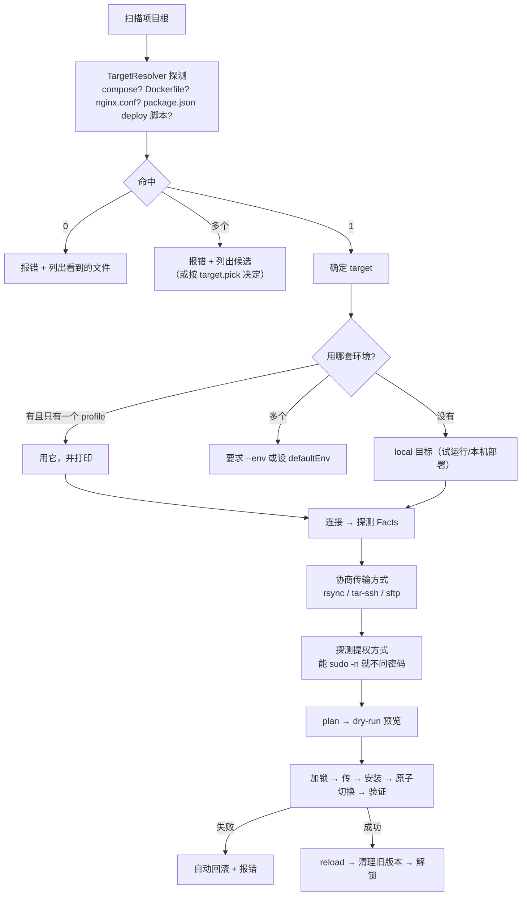

# deploy-kit

> 一个用 pnpm 单仓多包写的部署工具：**把目录或文件，通过 rsync / scp / ssh / 未来的任何手段，部署到 nginx / docker / 未来的任何目标；目标可以在远端，也可以在本机。**
>
> 设计完成，**骨架与首条纵向链路已落地，端到端已跑通**（本机路径为真跑；远端真机用例默认跳过，需 `DP_SSH_E2E=1`）。
> README 描述目标形态，当前实现见下文「当前进度」，里程碑的逐项状态见 `docs/DESIGN.md`。

真正的一键式：

```bash
dp deploy          # 自动识别项目类型、自动选传输方式、自动提权、自动验证，失败自动回滚
dp rollback        # 回到上一个版本
```

不需要写配置文件 —— 不写也能用（见 [零配置流程](#零配置流程)）。想控制细节时，配置从 3 个字段起步，逐渐加 Complexity（见 [`docs/config.md`](./docs/config.md)）。

---

## 当前进度

已实现并可跑：

| 包 | 状态 | 说明 |
| --- | --- | --- |
| `@dp/ports` | ✅ | 零依赖纯类型：Facts / Capabilities / Layout / Runner / SourceEntry / Target / DpError |
| `@dp/schema` | ✅ | schema DSL（类型推导 + 路径定位 + JSON Schema 导出）、`define*` 辅助、偏好链 |
| `@dp/core` | ✅ | `makePlan()` 纯函数：跨平台路径校验、布局推导、release root 候选推导、step 生成；另有目标类型探测（证据表 + 保守仲裁：0 命中报错不假装 static、同分报错不暗选） |
| `@dp/local` | ✅ | 本机 Runner：能力**实证**、命令执行包装（不经 shell / 不交互 / 不无限等待）、源枚举 |
| `@dp/target-static` | ✅ | 静态投放：releases/\<id\> + current 原子切换 + keep N + 自动回退与 rollback |
| `@dp/log` | ✅ | 结构化日志：JSONL 输出、出口统一脱敏（词段匹配 key + 值模式）、字段对齐 OTel、零运行时依赖 |
| `@dp/ssh` | ✅ | 远端 Runner：驱动偏好链 `native-ssh` → `ssh2`、主机密钥四态、SSH_ASKPASS 免 sshpass、能力实证探测 |
| `@dp/cli` | ✅ | 命令行：`plan` / `facts` / `schema` / `apply` / `deploy` / `status` / `verify` / `rollback`；配置发现与冲突检测、退出码契约。`deploy` 是零配置入口（不写配置文件也能用） |
| `@dp/transport` | ✅ | 传输协商与执行：`rsync-ssh` / `tar-ssh` / `sftp` / `scp` / `local-copy`，全部 argv-only；远端 `apply` 已走它 |
| `@dp/template` | ✅ | 纯模板渲染：`${env.NAME}` / `${git.*}` / `${release.*}` 展开 + 按落点分档的危险字符校验。零 IO，`$host` 之类原样保留 |
| `@dp/target-nginx` | ✅ | nginx 目标：conf 渲染 + 步骤规划 + 执行器 + CLI/schema 接线（反代默认头、影子校验、所有权保护、两步 `-t`、失败按步骤 undo 回收）。confd 由实测可写性推导 |
| `@dp/target-docker` | ✅ | docker 目标（`remote-cli`）：compose argv 构造 + `ps --format json` 解析 + 四个 plan 步骤 + 执行器 + CLI/schema 接线。失败**不自动补偿**（既不 `down` 也不 up 上一版），只给可执行的 `healing` |

远端 `apply` 的接线方式：**只把「把源搬进 staging」交给传输层**，`releases/<id>.incoming` →
rename → 换 `current` → 健康检查 → 保留 N 版这条链仍由 `@dp/target-static` 独占 —— 补偿逻辑只有一份。
本机目标不经过传输层（同机没有「跨机传输」这回事），保持逐条写文件。

命令行：

```bash
dp plan --json          # 干跑：布局 / 发布根候选（含实证可写性）/ 每一步与它的撤销项
dp facts --json         # 目标机事实与能力（全部实测，不靠 uid 推断）
dp schema               # 导出 JSON Schema，写进编辑器就有补全与校验
dp apply --dry-run      # 只算不写；去掉 --dry-run 就是真部署
dp apply --json         # 真部署：写 releases/<id> → 原子切 current → 健康检查 → 保留 N 版
dp status --json        # 当前版本 / 上一版 / 健康与否（只读）
dp verify --json        # 只跑健康检查，不通过退 2（CI 用）
dp rollback --json      # 切回上一版并复查；只切换，不删任何版本
```

`apply` 失败时会自动回滚：健康检查不过退 **2**（已回滚），装配期错误退 **3**，环境缺依赖退 **4**，
其他失败退 **1**。回滚本身失败时不假装成功，会明确报告 `needsHealing` 并给出人工下一步命令。

纵向链路已接通：**配置 → `makePlan()` → 本机真实部署 → 版本号切换 → 回滚**（`packages/core/src/slice.test.ts`）。

`dp apply` 在配了 `target.nginx` 时按 **install → deploy → activate** 三段走：先把 conf 渲染到影子目录过一遍 `nginx -t`（碰生产目录之前挡掉坏 conf），再切版本，最后原子换 conf 并 reload。activate 失败**不回滚发布**——版本本身是好的，旧 conf 指向 `current` 软链所以服务没断，但退出码非 0。

尚未实现：其它目标类型（`systemd` / `process`）。

`dp deploy` 已接线：盘上没有配置文件时走零配置（`@dp/cli` 的 `deriveZeroConfig`）—— 源根、
目标类型、环境三件事自动决定，每一步打印理由，产物只在内存里（不替你写一份配置文件）。
它**默认干跑**，加 `--yes` 才落盘：用户一行配置都没写过时，直接动目录太激进。
有配置文件时行为与 `dp apply` 一致，零配置不介入。

三条运维命令已接线，语义刻意分开：

```bash
dp status  --json   # 报告事实：当前版本 / 上一版 / 共几版 / 健康与否。查到坏消息也退出 0（零副作用）
dp verify  --json   # CI 的闸：只验当前 current，不通过退 2
dp rollback --json  # 切回上一版，然后**再验一次**；新版本不健康就 needsHealing + 退 2，不假装成功
```

`rollback` 只切换、不清理（删版本是 `apply` 里 prune 的事：上一版是被保护的版本，
把清理混进回滚，一次失败的回滚就可能顺手毁掉唯一的退路）。它也**不接受 `--dry-run`** ——
回滚要么做要么不做，「演练回滚」本身就是切一次。

多跳：**已落地**。配置写 `hosts.*.ssh.hops`，逐跳 `{ ssh, auth, knownHosts, port }`，
最后一跳就是目标机。两种驱动的实现方式不同，能力也不对称：

- `native-ssh`（默认）：把链拼成 `-o ProxyJump=`，由系统 ssh 自己发起跳板连接。
  **代价是逐跳只能用 key / agent**，且逐跳不能单独设 knownHosts —— `-J` 只有一条命令行，
  我们既没有它的凭据通道，也保证不了不交互（它会去读 tty，在 CI 里就是一次永久挂起）
- `ssh2`（降级路径）：逐跳 direct-tcpip 串成链，把通道当 `sock` 交给下一跳的 Client。
  **逐跳认证独立**（可以密码），代价是 ssh2 不支持任何抗量子 KEX。跳板禁 TCP 转发时可开
  `allowNcHopFallback` 用跳板上的 `nc` 兜底（默认关 —— nc 是在跳板机上起进程）

多跳 + rsync 隧道只有 `native-ssh` 能走：ssh2 侧的隧道要一条常驻的父子 IPC 端点，
与「每次 exec 一次性连接」不合，所以那里明确失败而不是给一条走不通的通道。

```bash
pnpm verify      # build + test + 覆盖率 + 六项静态门禁（产物落在 build/，lcov 在 build/coverage/）
```

---

## 目录地图

```
packages/
  ports/        纯类型与错误码
  schema/       配置 DSL 与 define* 辅助
  core/         plan 纯函数（布局推导、路径校验、step 生成）
  local/        本机 Runner（能力实证、命令执行、源枚举）
  target-static/静态投放目标
  template/     纯模板渲染（变量展开 + 按落点分档校验，零 IO）
  target-nginx/ nginx 目标：conf 渲染 + 步骤规划 + 执行器
  target-docker/docker 目标（remote-cli）：compose argv + ps 解析 + plan 步骤 + 执行器
  log/          结构化日志（JSONL + 出口脱敏）
  ssh/          远端 Runner（驱动偏好链 · 主机密钥 · 能力实证）
  cli/          命令行：配置发现 · plan / facts / schema · 退出码
docs/
  diagrams.md    ★ 图集：全景 / 分层 / 数据流 / 状态机 / 各决策链（结构与流程以这里为准）
  DESIGN.md     总体设计：分层、管线、release 布局、并发隔离、扩展点、安全、里程碑
  transport.md  多跳 SSH / sudo·su 提权 / 无 sshpass / rsync 走自建隧道
  privilege.md  ★ 不假设 root：能力集实证、三种布局推导、普通用户模式的能与不能
  config.md     配置模型：最简形态、多环境、集群扇出、容器构建推拉、交叉编译、自动识别
  security.md   威胁模型、抗量子密钥协商、凭据、命令注入、供应链
  transaction.md 全局事务：撤销补偿、状态自愈、不可逆操作的分类与拦截
  preflight.md  部署前预检：写第一个字节之前把所有失败原因穷举完
  verify.md     健康检查与验收裁决（重点：容器/data卷/端口/镜像 digest）
  transfer-streaming.md  流式传输：本机不落地 · 边传边哈希 · 自适应流控
  sources.md    源产物：归档 / deb·rpm·apk / ISO / 单文件 的识别与落地
  testing.md    五层测试：纯单元 → 本地端到端 → 假 SSH 服务器 → 真工具 → 变异/属性
  packaging.md  发包策略：出口约定、依赖策略、changesets、包 smoke
  spikes.md     ★ 实测结论：ssh2 不支持抗量子 / SSH_ASKPASS / 多跳降级 / rsync --rsh 契约
  failures.md   ★ 故障分类学与护栏层：两阶段激活、租约锁、资源护栏、带外救援
  decisions.md  ★ 决策清单（第 3–24 条）：偏好链、define*、日志、hook、SELinux、scp、CLI
  troubleshooting.md  环境相关故障：pnpm 链接 / esbuild / 覆盖率落盘 / NUL 文件 / 容器代理
```

---

## 零配置流程

不带 `--config` 且目录里没有配置文件时，`dp deploy` 按顺序做这些决定，**每一步都打印理由**：



三条不可省的诚实原则：

- **多环境不能猜**：有多个 profile 且没指定 `--env` 时**报错**，不默认挑第一个（猜错了就是把预发的东西发到生产）
- **target 冲突不能猜**：同时检测到 compose 和 nginx.conf 时**报错**并列出候选，除非用户配过 `target.pick`
- **自动不等于静默**：所有自动决定都打印一行「为什么」，并且都能在终端用参数覆盖

---

## 五条硬规则

1. **`core` 不知道 ssh 存在。** 它只认 `Runner` 端口；本地目标和远端目标共用同一条管线 —— 这条由 ESLint 的 import 限制守着。
2. **`plan()` 是纯函数。** `(config, facts) → steps`，不做任何 IO。dry-run、快照测试、CI 里的离线 plan 全靠它。
3. **配置项只有一份 zod schema。** TS 类型与 JSON Schema 都由它派生；手写第二份类型视为缺陷。
4. **命令一律 argv。** `quote()` 是 shell 转义的唯一出口，且必须过属性测试。
5. **默认值保守。** `--delete`、覆盖非托管文件、prune 旧版本、`knownHosts: none`、不抗量子的连接 —— 全部需要显式打开，且 `dp check --security` 能一次列出所有偏离。

---

## 质量门禁

**当前 `pnpm verify` = `build` + `test` + 七项静态门禁**（见根 `package.json`）。七项按
`dead-code` → `check-imports` → `check-tests` → `check-jsdoc` → `check-coverage` → `smoke` → `accept-gates` 依次串起，
单独跑它们的那一段叫 `verify:gates`。`check-coverage` 只读 `test` 产出的 `build/coverage/lcov.info`，
`smoke` 只读 `build/` 产物 —— 排在 `build` / `test` 之前跑它们，拿到的是编排错误而不是质量信号。
CI 只跑这一条 `pnpm verify`，不挑着跑。下面这张表是这套门禁**想达到的强度**，
其中只有一部分已经落地 —— 没落地的标 ❌，别当成已经在跑的保障。

| 项 | 要求 | 状态 |
| --- | --- | --- |
| `typecheck` | 源码与测试各一个 project，均 `--noEmit` | ✅ 由 `tsc -b` 承担 |
| `build` | 产物落各包 `build/`，测试跑的是产物不是源码 | ✅ |
| `test` | `node --test`（Node 24 内置运行器），lcov 落 `build/coverage` | ✅ |
| `lint` | 含五条硬规则里的 **import 边界**限制（`no-restricted-imports`），违规即失败 | ❌ 未配置：仓库里没有 lint 工具与配置文件（跨层与循环由下一行的 `check-imports` 承担） |
| 依赖检查 | **严禁循环依赖**与跨层反向依赖，工具校验而不是靠自觉 | ✅ `scripts/check-imports.mjs`，当前通过（跨层反向 0 / 环 0） |
| 死代码 | 没有未被引用的导出/文件；**见到冗余代码就删，不留「以后可能用」** | ✅ `scripts/dead-code.mjs`，当前 0 处 |
| `smoke` | 发布产物能被真实 import | ✅ `scripts/smoke.mjs`，12 个包通过；凭据只在非测试产物里硬失败 |
| JSDoc | 每个函数都要中文描述 + 逐个 `@param` + `@returns`，描述写「为什么」 | ✅ `scripts/check-jsdoc.mjs`，465 个公共 API 符号缺口 0 |
| 假测试 | 弱断言 / 被忽略的校验参数要能被扫出来；**恒等断言**（两个实参是同一表达式的拷贝、永不失败）与零断言同级判 P0 | ✅ `scripts/check-tests.mjs`，当前 P0 致命 0 |
| 门禁自检 | 给每个门禁注入一次它理应抓到的违规，对照必须绿、注入必须红 —— 否则「全绿」可能是它根本抓不到东西 | ✅ `scripts/accept-gates.mjs`，9 组注入全过（只改 `.tmp/gate-mut/` 下的副本） |
| 变异测试 | nightly 跑：故意改坏源码，红 = 真守着，绿 = 形同虚设 | ⚠️ `scripts/mutate.mjs` 已落地（只改 `.tmp/` 下的副本，不碰真实产物），**未接进 `verify`** —— 它验的是「测试有没有守住源码」，与上一行验的「门禁有没有守住仓库」不是一回事，两者都要有 |
| 覆盖率 | 纯逻辑包（`schema` / `core` / `template`）**三项 100%**；IO 层靠契约测试与集成，不追数字 | ✅ `scripts/check-coverage.mjs`，三个受门禁包均达 100% |
| 发版 | Conventional Commits，scope 用包名；版本由 changesets 推导 | ❌ changesets 未接入，版本号手工维护 |

对**不可达分支**的处理沿用参考项目的定式：先分清是「没测到」还是「根本走不到」；走不到就**改代码删掉**，不许写替身去凑。

---

## 命令

| 命令 | 干什么 |
| --- | --- |
| `dp deploy [project]` | 部署（默认先干跑预览，CI 里加 `--yes`） |
| `dp plan` | 只出计划，不执行；可配 `--facts` 在离线 CI 里跑 |
| `dp rollback [release]` | 回滚到上一个版本或指定版本 |
| `dp releases` | 看各主机当前版本，集群是否一致 |
| `dp check` | 体检：连接、Facts、依赖、安全默认值偏离 |
| `dp check --crypto` | **逐跳**输出协商出的 kex / cipher / 主机密钥，标注是否抗量子 |
| `dp exec <cmd>` | 在目标上跑一条命令（走同样的多跳与提权） |
| `dp schema` | 导出 JSON Schema，写进 `$schema` 就有编辑器补全 |
| `dp init` | 从项目里检测到的事实生成一份最小配置 |

exit code 约定：成功 `0` / 部署失败 `1` / **验证失败且已回滚 `2`** / 配置错 `3` / 环境缺依赖 `4`。

---

## 技术选型（已确认的部分）

| 项 | 选择 | 理由 |
| --- | --- | --- |
| SSH 客户端 | 双驱动，偏好链 `native-ssh` → `ssh2@1.17.0` | 抗量子只能靠系统 ssh（spike 实测 ssh2 不支持任何 PQC KEX），所以 native-ssh 排在前；ssh2 零外部依赖，且自带 SSH 服务端可起假服务器做测试。退化到 ssh2 时必须明示「这条连接不抗量子」 |
| 校验 | `zod` v4 | 类型 + 运行时校验 + JSON Schema 导出一套产出 |
| 传输 | rsync + `tar-ssh` + sftp 三选协商 | 本机没有 rsync 时自动降级，且降级原因要打进日志 |
| 测试 | `node --test`（Node 24 内置运行器）+ 进程内假 ssh 服务端 | **不用 vitest**：它的 esbuild 平台二进制在部分环境装不上，而内置运行器零依赖且够用 |
| 语言/包管理 | TypeScript + pnpm workspace | 与参考项目 `ds-foundation` 的约定保持一致 |

### 需要动手就先查清的两件事

1. **抗量子只能走 `native-ssh` 驱动**：spike 实测 `ssh2` 不支持任何 PQC KEX（`mlkem768x25519-sha256` / `sntrup761` 都没有），而 OpenSSH 10.3 默认就协商 `mlkem768x25519-sha256`。所以驱动偏好链是 `native-ssh` → `ssh2`，且**退化到 ssh2 时必须明示"这条连接不抗量子"**。结论见 `docs/spikes.md`。
2. **`ssh2` 的可选依赖会触发原生编译**：`cpu-features` / `nan` 需要本地编译且被 pnpm 的构建脚本白名单拦着。**建议跳过可选依赖**（只影响默认 cipher 择优，而我们本来就会显式指定 cipher 列表）。

---

## 容易被忽略、但设计里已经处理的点

| 坑 | 处理 |
| --- | --- |
| 中间跳板会把整条 SSH 链的加密强度拖弱 | crypto 策略**逐跳应用**，`check --crypto` 逐跳报告 |
| 交叉编译的构产物没法在本机验证 | 强制更强的 healthcheck，否则明确警告 |
| `mv -T` 在 busybox 上不存在；Windows 软链接要权限 | `switchStrategy` 按 Facts 协商退化，并告知「这次不是原子切换」 |
| 迁移 SQL 不能跟着回滚 | 数据库变更单独放在 `hooks.migrate`，回滚策略默认 `none`，不假装能回滚 |
| 源树里藏个指向 `/etc/passwd` 的软链接 | 传输前扫描源树，拒绝指向源根之外的符号链接 |
| 上传后才发现文件坏了 | 写完 release 就落 `.dp/checksums.txt`，激活与回滚前都先验 |
| 上一次部署崩在半路，锁和 `current` 不一致 | 锁带 TTL 与持有者信息可自愈；`current` 悬空时自动回到最后一个健康版本并告警 |
| SELinux 环境下换了文件但上下文不对 | RHEL 系自动追加 `restorecon -R` 步骤（按 Facts 判断） |
| Windows 本机路径/换行/权限语义不同 | 内部路径统一 POSIX，在 Runner 边界转换；传输流二进制安全不转换换行；Windows 上 chmod 降级为空操作并提示 |
| 大文件传一半断了 | `streamExec` 处理好背压；传输后占比 corpus 校验，不做无意义的断点续传设计 |

---

## 文档索引

- 想看懂整体结构 → [`docs/DESIGN.md`](./docs/DESIGN.md)
- 想搞清多跳与提权怎么实现 → [`docs/transport.md`](./docs/transport.md)
- 想知道配置能写成什么样 → [`docs/config.md`](./docs/config.md)
- 想确认安全策略 → [`docs/security.md`](./docs/security.md)
- 想知道怎么保证不出回归 → [`docs/testing.md`](./docs/testing.md)
