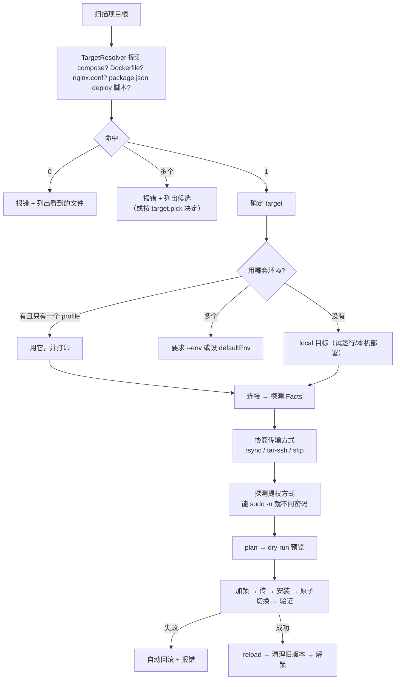

# deploy-kit

> 一个用 pnpm 单仓多包写的部署工具：**把目录或文件，通过 rsync / scp / ssh / 未来的任何手段，部署到 nginx / docker / 未来的任何目标；目标可以在远端，也可以在本机。**
>
> 当前阶段：**设计完成，尚未动工。** README 描述的是要建的东西。

真正的一键式：

```bash
dp deploy          # 自动识别项目类型、自动选传输方式、自动提权、自动验证，失败自动回滚
dp rollback        # 回到上一个版本
```

不需要写配置文件 —— 不写也能用（见 [零配置流程](#零配置流程)）。想控制细节时，配置从 3 个字段起步，逐渐加 Complexity（见 [`docs/config.md`](./docs/config.md)）。

---

## 目录地图

```
docs/
  diagrams.md    ★ 图集：全景 / 分层 / 数据流 / 状态机 / 各决策链（结构与流程以这里为准）
  DESIGN.md     总体设计：分层、管线、release 布局、并发隔离、扩展点、安全、里程碑
  transport.md  多跳 SSH / sudo·su 提权 / 无 sshpass / rsync 走自建隧道
  privilege.md  ★ 不假设 root：能力集实证、三种布局推导、普通用户模式的能与不能
  config.md     配置模型：最简形态、多环境、集群扇出、容器构建推拉、交叉编译、自动识别
  security.md   威胁模型、抗量子密钥协商、凭据、命令注入、供应链
  transaction.md 全局事务：撤销补偿、状态自愈、不可逆操作的分类与拦截
  preflight.md  部署前预检：写第一个字节之前把所有失败原因穷举完
  verify.md     健康检查与验收裁决（重点：容器/data卷/端口/镜像 digest）
  transfer-streaming.md  流式传输：本机不落地 · 边传边哈希 · 自适应流控
  sources.md    源产物：归档 / deb·rpm·apk / ISO / 单文件 的识别与落地
  testing.md    五层测试：纯单元 → 本地端到端 → 假 SSH 服务器 → 真工具 → 变异/属性
  packaging.md  发包策略：出口约定、依赖策略、changesets、包 smoke
  spikes.md     ★ 实测结论：ssh2 不支持抗量子 / SSH_ASKPASS / 多跳降级 / rsync --rsh 契约
  failures.md   ★ 故障分类学与护栏层：两阶段激活、租约锁、资源护栏、带外救援
  decisions.md  ★ 决策清单（第 3–24 条）：偏好链、define*、日志、hook、SELinux、scp、CLI
```

---

## 零配置流程

不带 `--config` 且目录里没有配置文件时，`dp deploy` 按顺序做这些决定，**每一步都打印理由**：



三条不可省的诚实原则：

- **多环境不能猜**：有多个 profile 且没指定 `--env` 时**报错**，不默认挑第一个（猜错了就是把预发的东西发到生产）
- **target 冲突不能猜**：同时检测到 compose 和 nginx.conf 时**报错**并列出候选，除非用户配过 `target.pick`
- **自动不等于静默**：所有自动决定都打印一行「为什么」，并且都能在终端用参数覆盖

---

## 五条硬规则

1. **`core` 不知道 ssh 存在。** 它只认 `Runner` 端口；本地目标和远端目标共用同一条管线 —— 这条由 ESLint 的 import 限制守着。
2. **`plan()` 是纯函数。** `(config, facts) → steps`，不做任何 IO。dry-run、快照测试、CI 里的离线 plan 全靠它。
3. **配置项只有一份 zod schema。** TS 类型与 JSON Schema 都由它派生；手写第二份类型视为缺陷。
4. **命令一律 argv。** `quote()` 是 shell 转义的唯一出口，且必须过属性测试。
5. **默认值保守。** `--delete`、覆盖非托管文件、prune 旧版本、`knownHosts: none`、不抗量子的连接 —— 全部需要显式打开，且 `dp check --security` 能一次列出所有偏离。

---

## 质量门禁（与参考项目同一强度）

`pnpm verify` = **typecheck → lint → 依赖检查 → 死代码检查 → test → build → smoke**，顺序不可改（产物层的断言依赖构建产物）。

| 项 | 要求 |
| --- | --- |
| `typecheck` | 源码与测试各一个 project，均 `--noEmit` |
| `lint` | 含 §五条硬规则里的 **import 边界**限制（`no-restricted-imports`），违规即失败 |
| 依赖检查 | **严禁循环依赖**与跨层反向依赖，工具校验而不是靠自觉 |
| 死代码 | 没有未被引用的导出/文件；**见到冗余代码就删，不留「以后可能用」** |
| 测试 | 纯逻辑包（`schema` / `core` / `template` / 协商策略）**四项 100%**；IO 层靠契约测试与集成，不追数字 |
| 变异测试 | nightly 跑：故意改坏源码，红 = 真守着，绿 = 形同虚设。100% 覆盖率不等于行为被验证 |
| JSDoc | 每个函数都要中文描述 + 逐个 `@param` + `@returns`，描述写「为什么」 |
| 提交 | Conventional Commits，scope 用包名；版本由 changesets 推导 |

对**不可达分支**的处理沿用参考项目的定式：先分清是「没测到」还是「根本走不到」；走不到就**改代码删掉**，不许写替身去凑。

---

## 命令

| 命令 | 干什么 |
| --- | --- |
| `dp deploy [project]` | 部署（默认先干跑预览，CI 里加 `--yes`） |
| `dp plan` | 只出计划，不执行；可配 `--facts` 在离线 CI 里跑 |
| `dp rollback [release]` | 回滚到上一个版本或指定版本 |
| `dp releases` | 看各主机当前版本，集群是否一致 |
| `dp check` | 体检：连接、Facts、依赖、安全默认值偏离 |
| `dp check --crypto` | **逐跳**输出协商出的 kex / cipher / 主机密钥，标注是否抗量子 |
| `dp exec <cmd>` | 在目标上跑一条命令（走同样的多跳与提权） |
| `dp schema` | 导出 JSON Schema，写进 `$schema` 就有编辑器补全 |
| `dp init` | 从项目里检测到的事实生成一份最小配置 |

exit code 约定：成功 `0` / 部署失败 `1` / **验证失败且已回滚 `2`** / 配置错 `3` / 环境缺依赖 `4`。

---

## 技术选型（已确认的部分）

| 项 | 选择 | 理由 |
| --- | --- | --- |
| SSH 客户端 | `ssh2@1.17.0`（纯 JS） | 本机实测**没有 sshpass**；`ssh2` 在协议层解决密码/键盘交互认证，顺带把多跳与 rsync 隧道一起解决。它还自带 SSH 服务端，测试能用假服务器 |
| 校验 | `zod` v4 | 类型 + 运行时校验 + JSON Schema 导出一套产出 |
| 传输 | rsync + `tar-ssh` + sftp 三选协商 | 本机没有 rsync 时自动降级，且降级原因要打进日志 |
| 测试 | vitest + 进程内 ssh2 服务端 | 多跳、pty 提权、断连全部无外部依赖可测 |
| 语言/包管理 | TypeScript + pnpm workspace | 与参考项目 `ds-foundation` 的约定保持一致 |

### 需要动手就先查清的两件事

1. **Node 版本与抗量子的关系**：ML-KEM 混合密钥协商依赖 Node ≥ 24.7 的底层支持，本机是 **22.22.2**。这决定了默认能不能走抗量子，建议 `.nvmrc` 提到 24 —— 先用最小脚本连本机 OpenSSH 10.3 实测 `ssh2` 能协商出什么再定论。
2. **`ssh2` 的可选依赖会触发原生编译**：`cpu-features` / `nan` 需要本地编译且被 pnpm 的构建脚本白名单拦着。**建议跳过可选依赖**（只影响默认 cipher 择优，而我们本来就会显式指定 cipher 列表）。

---

## 容易被忽略、但设计里已经处理的点

| 坑 | 处理 |
| --- | --- |
| 中间跳板会把整条 SSH 链的加密强度拖弱 | crypto 策略**逐跳应用**，`check --crypto` 逐跳报告 |
| 交叉编译的构产物没法在本机验证 | 强制更强的 healthcheck，否则明确警告 |
| `mv -T` 在 busybox 上不存在；Windows 软链接要权限 | `switchStrategy` 按 Facts 协商退化，并告知「这次不是原子切换」 |
| 迁移 SQL 不能跟着回滚 | 数据库变更单独放在 `hooks.migrate`，回滚策略默认 `none`，不假装能回滚 |
| 源树里藏个指向 `/etc/passwd` 的软链接 | 传输前扫描源树，拒绝指向源根之外的符号链接 |
| 上传后才发现文件坏了 | 写完 release 就落 `.dp/checksums.txt`，激活与回滚前都先验 |
| 上一次部署崩在半路，锁和 `current` 不一致 | 锁带 TTL 与持有者信息可自愈；`current` 悬空时自动回到最后一个健康版本并告警 |
| SELinux 环境下换了文件但上下文不对 | RHEL 系自动追加 `restorecon -R` 步骤（按 Facts 判断） |
| Windows 本机路径/换行/权限语义不同 | 内部路径统一 POSIX，在 Runner 边界转换；传输流二进制安全不转换换行；Windows 上 chmod 降级为空操作并提示 |
| 大文件传一半断了 | `streamExec` 处理好背压；传输后占比 corpus 校验，不做无意义的断点续传设计 |

---

## 文档索引

- 想看懂整体结构 → [`docs/DESIGN.md`](./docs/DESIGN.md)
- 想搞清多跳与提权怎么实现 → [`docs/transport.md`](./docs/transport.md)
- 想知道配置能写成什么样 → [`docs/config.md`](./docs/config.md)
- 想确认安全策略 → [`docs/security.md`](./docs/security.md)
- 想知道怎么保证不出回归 → [`docs/testing.md`](./docs/testing.md)
