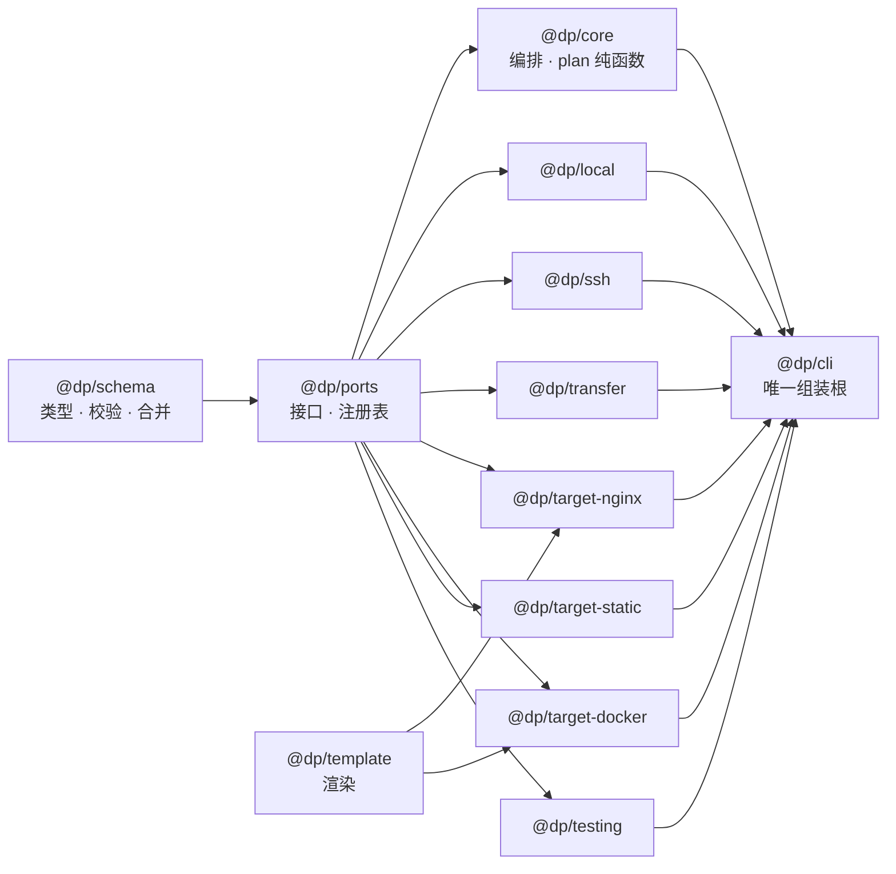
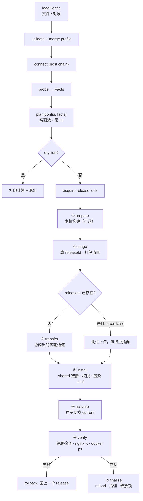
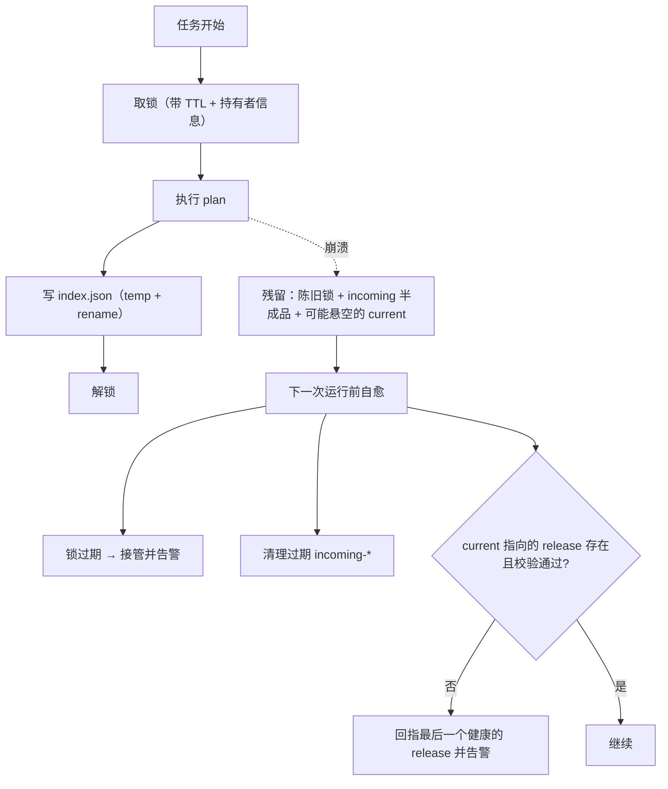

# deploy-kit 设计文档

> 一句话：**把「部署到哪里 / 怎么生效」与「用什么手段把字节送过去」彻底分开，中间用一个纯函数的 plan 连接。**

本文是项目的总体设计。另有三份配套文档：

| 文档 | 讲什么 |
| --- | --- |
| [`docs/transport.md`](./transport.md) | SSH 多跳、sudo/su 提权、无 sshpass、rsync 走自建隧道 —— 最难的部分单独展开 |
| [`docs/config.md`](./config.md) | 配置模型、Schema 单一真源、完整字段参考与示例 |
| [`docs/testing.md`](./testing.md) | 为什么这套设计天生可测，以及五层测试怎么排 |

---

## 0. 先回答五个问题

设计之前先把自己问透，答案决定了后面的每个取舍：

**Q1. 为什么是单仓多包，而不是一个大 CLI？**
因为「目标适配器（nginx / docker / 未来的东西）」和「传输手段（rsync / tar / sftp / 未来的东西）」是**两组会各自长大的概念**。写在一起，加一个新 target 就要改 CLI 核心；拆成包 + 注册表，加一个同级包即可，旧代码一行不动。判断依据和参考项目一样：**换一个 target（或换一种传输方式）时要改的东西越少，分层越对。”的东西，需要改动的范围越小，分层越对。**

**Q2. 为什么 plan 必须是纯函数？**
因为「我要在远端执行什么命令」这件事，**完全可以由配置 + 探测结果决定**，不需要真的连上去才知道。一旦它是纯的：(a) `--dry-run` 就是免费的；(b) 测试不用起服务器；(c) 相同输入必然相同输出，可做快照；(d) 出了问题，`deploy.json` 就是事故回放的一手证据。反之，如果 plan 里夹着「连上去看看再决定」，以上四条全部作废。

**Q3. 本机没有 sshpass，怎么喂密码？**
根本不需要 sshpass。sshpass 存在的唯一理由是**系统 ssh 二进制只从 TTY 读密码**。如果我们自己用 `ssh2`（纯 JS SSH 实现）做客户端，密码、键盘交互认证都是在协议层解决的 —— 这也顺带解决了多跳和 rsync 隧道。详见 [`transport.md`](./transport.md)。

**Q4. 远端和本地要分开写两套逻辑吗？**
不要。它们被抽象成同一个 `Runner` 端口，**本地目标只是 `Runner` 的一个实现**。一条管线既能投到跳板机后面的内网服务器，也能投到本机目录 —— 这不是「顺便支持」，而是这条抽象是否正确的唯一检验方式。

**Q5. 「其他」怎么长出来？**
任何以字符串 key 解析的东西，都是可扩展点：`host.type`、`transport.strategy`、`target.type`、`become.type`、`auth.type`、钩子、`secretRef` scheme。规则只有一条：**扩展点必须是「按名字查注册表」，不能是一处 switch。**

---

## 1. 生态调研：能用现成的吗？

调研结论 —— **借鉴而不依赖**，理由写右边：

| 候选 | 结论 | 理由 |
| --- | --- | --- |
| `ssh2`（mscdex） | ✅ **强依赖** | 纯 JS SSH 客户端 + **服务端**。客户端解决 sshpass 问题；服务端让我们能写「假 SSH 服务器」做集成测试 —— 这是本项目测试能力的关键来源 |
| `ssh2-sftp-client` | ⚠️ 借鉴 API 形状 | 它的 API 形状值得抄，错误分类与 `fastPut` 语义可以借，但它自己管连接生命周期，插不进我们的多跳隧道 —— 不直接依赖 |
| `ssh-hop` | ⚠️ 借鉴概念 | 已有人做多跳编排（hops 数组、任意跳执行）。太薄，且我们需要在其中插入提权、探测、隧道复用，自己实现约 200 行更可控 |
| `node-ssh` | ⚠️ 借鉴 `execCommand` 语义 | 做过一层薄封装，适合单跳简单场景；不支持多跳/提权，用它等于给自己设天花板 |
| `rsync`（jhundley9109 fork）/ `rsyncwrapper` | ⚠️ 借鉴命令行构造 | 只能用系统 ssh。我们要自定义 `--rsh`，得自己控制子进程，但它们的 flag 构造值得参考 |
| 纯 JS rsync 实现 | ❌ 不存在可靠的 | rsync 的 delta 算法 + 协议版本协商是几十年活儿。**不重造**，改用「本机 rsync 二进制 + 自建隧道」与「不带 rsync 的降级通道」两条路 |
| `zod`（v4） | ✅ **强依赖** | 单一真源：类型、运行时校验、**JSON Schema 导出**（`z.toJSONSchema`）三件事一套产出 |
| `c12` / `jiti` | ✅ 二选一 | 让 `deploy.config.ts` 直接可用，这才谈得上「TS 配置有参数提示」 |
| `tar-stream` | ✅ 候选 | 「无 rsync 降级通道」需要纯 JS 打包，配合 `node:zlib` |
| Capistrano / Deployer / Fabric | ✅ 借鉴模式 | releases + current 软链接 + keep N + rollback，是被二十年验证过的布局，直接用 |

**一句话**：shell 层不用自己写协议，配置层不用自己写校验，剩下的「命令编排 + 传输协商 + 提权交互」才是本项目真正的产品价值，这部分必须自己写才能控制不可控的部分。

---

## 2. 分层与包结构

```
packages/
  schema       纯：zod schema、派生类型、归一化、profile 合并、变量插值、默认值策略
  ports        纯：接口与注册表（Runner / RemoteFs / Transferer / Target / SecretProvider / Logger / Responder）
  core         纯 IO：编排 —— plan() / run() / rollback()，release 管理、锁、钩子、错误分类
  template     纯：模板渲染（${release.current} 等变量）、危险字符校验

  local        Runner 实现：本地目标（子进程 + node:fs）
  ssh          Runner 实现：ssh2 多跳链、认证、known_hosts、提权交互、能力探测、dp-rsh 隧道助手
  transfer     传输策略：rsync / tar-ssh / sftp / local / docker-load，按 Facts 自动协商

  target-static  静态文件 / 通用目录
  target-nginx   conf 渲染（含反代）、校验、原子切换、reload
  target-docker  compose / build / image / registry

  testing      测试基建：假 Runner（内存 FS）、假 SSH 服务器、Facts 夹具、plan 快照工具
  cli          命令行 + 组装根（唯一的接线处）
```

依赖图（`-->` 表示依赖）：



四条边界规则，**用 ESLint 的 `no-restricted-imports` 强制**，不靠自觉：

1. `schema` / `core` / `template` 里不许出现 `node:fs`、`node:child_process`、`node:net`
2. `core` 里不许 import `@dp/ssh`、`@dp/local`、`@dp/transfer` —— **它不知道它们存在**
3. 具体 target 包不许 import 另一个 target 包
4. 只有 `cli`（以及用户在代码里调用的 `deploy()`）可以组装具体实现

第 2 条是整套设计的支柱。违反它，本地目标和远端目标就会长成两套代码。

---

## 3. 两个正交维度：target 与 host

一个配置里最容易写歪的地方，是把「部署成什么」和「在哪台机器上」搅在一起。这里刻意拆开：

| 维度 | 负责 | 例子 |
| --- | --- | --- |
| **host（在哪）** | 连接与执行能力：怎么连、要不要提权、有没有 rsync | `ssh + 2 跳 + sudo`、`local` |
| **target（是什么）** | 落地语义：releases 布局、conf 放哪里、怎么 reload、怎么验健康 | `nginx`、`docker`、`static` |

于是：

- **远端 nginx** = `host: ssh(...)` + `target: nginx`
- **本机 nginx** = `host: local` + `target: nginx` ← 完全同一个 target 代码
- **远端 docker** = `host: ssh(...)` + `target: docker`

判断某个字段该放哪边：**换一台机器时它要不要改？要改的属于 host；换成 docker 部署时要改的属于 target。**

---

## 4. 三个核心数据结构

### 4.1 Facts（探测结果）

远程环境的**只读快照**，是 plan 的唯一输入之一。

```ts
type Facts = {
  os: { kind: 'linux' | 'darwin' | 'windows'; distro?: string; arch: string }
  user: { name: string; uid: number; groups: string[]; isRoot: boolean }
  tools: Record<string, { path: string; version?: string } | false>   // rsync / tar / nginx / docker / systemctl / sha256sum
  become: { sudo: boolean; sudoNopasswd: boolean; su: boolean; doas: boolean }
  paths: Record<string, boolean>
  probeVersion: number
}
```

三个约定：

- **一次探完**：别一路 wishing 一问。合并成一两个复合脚本拿完所有信息，减少往返（多跳下每次 exec 都是一条链）。
- **可注入**：来源可以是真探测、缓存文件（`--facts facts.json`）、或测试夹具。**`--dry-run --facts facts.json` 让 CI 也能出 plan，连不上服务器不是借口。**
- **不可信**：所有 Facts 都要过一层 zod 校验，远端返回异常格式应当报错而不是猜。

### 4.2 Plan（计划）

```ts
type Step = {
  id: string
  kind: 'exec' | 'upload' | 'remove' | 'mkdir' | 'symlink' | 'chmod' | 'render'
  where: 'local' | 'remote'
  // 具体某一项
  exec?: { argv: string[]; cwd?: string; env?: Record<string,string>; responder?: ResponderId }
  upload?: { transferId: string; from: string; to: string; opts?: object }
  render?: { templateRef: string; targetPath: string; vars: Record<string,unknown> }
  // 元信息，供 dry-run 展示、审计、危险操作拦截
  destructive?: boolean
  idempotent?: boolean
  description: string
}
type Plan = { id: string; releaseId: string; target: string; steps: Step[] }
```

注意 `exec.argv` 是**数组不是字符串**。命令注入在这里被结构性消灭：没有字符串拼接，就没有拼接错。

### 4.3 ExecResult

```ts
type ExecResult = {
  code: number
  stdout: string
  stderr: string
  durationMs: number
  redacted: boolean     // 输出是否已过脱敏
  channel: 'exec' | 'shell' | 'stream'
}
```

---

## 5. 部署管线



### 阶段职责

| 阶段 | 干什么 | 失败时的世界是什么样 |
| --- | --- | --- |
| prepare | 本机跑构建命令 | 远端**完全没动过** |
| stage | 算 conten hash → `releaseId` | 远端没动过 |
| transfer | 传到 `releases/<id>.incoming` | 远端多了一个临时目录，可清理 |
| install | shared 链接、权限、渲染 conf | 同上，可清理 |
| activate | `current` 原子换向 | **这是唯一的不可逆点**（前一帧仍在）. 见下 |
| verify | HTTP / 命令 / 容器状态 | 失败 → 自动 rollback |
| finalize | reload、prune 旧 release、解锁 | 若失败，业务已在跑，只是没清理 |

关键判断：**「生效」必须是一个单一、原子、可回退的动作**（软链接换向），前面所有操作都在一个「还没被引用」的目录里进行。这是全设计中最重要的一条，也是失败恢复能便宜的根本原因。

### releaseId 与幂等

```
releaseId = <yyyyMMdd-HHmmss>-<contentHash[0..8)>   # contentHash = 排序后的(路径, sha256, mode) 列表哈希
```

同内容重复部署 → 同一个 `releaseId` → 若远端已存在且完整，走「重指向」而不是重传。**这让 `deploy` 也可以当作快速的「回滚到某版𞄝」用**。

---

## 6. Release 布局与原子切换

```
/srv/web
├── releases/
│   ├── 20261001-003000-a1b2c3d4/
│   └── 20260930-120000-9f8e7d6c/
├── shared/
│   └── .env
├── current -> releases/20261001-003000-a1b2c3d4
└── .dp/
    ├── lock
    ├── index.json          # release 列表 + 上一个 + 时间戳
    └── trace/<deployId>.json
```

### 原子切换（POSIX）

```sh
ln -s releases/<id> .current.new && mv -T .current.new current
```

`ln -sfn` **不是原子的**（先删后建，中间有一帧没有 `current`），必须 `ln` + `mv -T`。两个退化场景要在 plan 期根据 Facts 决定：

- `mv -T` 不存在（busybox）→ 退化到 `mv .current.new current` 之前先 `rm -f current`（接受极小窗口），或直接换 `activateStrategy: 'rename'`（真的移动目录）
- 目标本机是 Windows（`local` runner）→ 软链接可能需要权限，退化到 `copy` 策略，**但必须告诉用户：这不再是原子切换，回滚窗口变了**

### 回滚

```json
// .dp/index.json
{ "current": "...a1b2c3d4", "previous": "...9f8e7d6c", "releases": [ ... ] }
```

回滚 = 「把 current 指向 previous」+ 「按 target 再走一遍 activate/verify」。注意它**不删任何东西**，所以回滚本身也可以重试。

---

## 7. 传输策略协商

| 策略 | 本机依赖 | 远端依赖 | 增量 | 保留权限/软链接 | 何时用 |
| --- | --- | --- | --- | --- | --- |
| `local` | 无 | 无 | 可选 rsync | ✅ | `host.type: local` |
| `rsync` | rsync 二进制 | rsync | ✅ 真增量 | ✅ | 两端都有 rsync（默认首选） |
| `tar-ssh` | 无（tar-stream + zlib） | tar + gzip | ❌ 全量 | ✅ | 本机没 rsync（Windows 常见）/ rsync 版本太老 |
| `sftp` | 无 | 只要 sshd | ✅ size/mtime/hash | ⚠️ 部分 | 远端没 rsync 也没 tar |
| `docker-load` | docker CLI | docker | — | — | 仅镜像流式加载 |

选择顺序：`显式指定 > Facts 协商 > 兜底 sftp`。**协商结果要写进 plan 和日志**：用户看到「本次用 tar-ssh，因为本机没有 rsync」比默默变慢重要得多。

危险开关：`transport.delete`（rsync `--delete`）默认 **false**，且首次部署时必须配 `force: true` —— 往一个非我们管理的目录里做 delete 是不可接受的默认行为。

---

## 8. 目标适配器

三者共用同一份 `install/activate/verify` 契约，差别只在 install 阶段的额外步骤：

```ts
type Target = {
  type: string
  planInstall(ctx): Step[]      // 传输之后的数据操作（渲染 conf 之类）
  planActivate(ctx): Step[]     // 生效（软链 / compose up / systemctl）
  planVerify(ctx): Step[]       // 健康检查
  planRollback(ctx): Step[]     // 回退，默认回到上一个 release
}
```

### 8.1 static

通用目录投放：传输 → shared 链接 → 权限 → 原子换向 → 验目录里存在关键文件（可由 `healthcheck.fileExists` 配）。

### 8.2 nginx（重点）

三件事要做对，细节见 [`config.md`](./config.md) 字段说明：

1. **conf 渲染**：用户输入的是结构化的 `server` / `locations` / `reverseProxy`，由我们拼出合法 conf。反向代理要自动带上 `Host` / `X-Real-IP` / `X-Forwarded-For` / `X-Forwarded-Proto`、`Upgrade` 头（websocket）、超时与缓冲参数 —— **这些是「默认正确」而不是「记得才写」**。
2. **校验**：`nginx -t` 校验的是**整棵 include 树**，所以候选文件必须先被包含进去才能验。两种做法：
   - **`shadow`（默认）**：把候选文件放到一个影子目录，生成一份临时的主配置 `include` 它，跑 `nginx -t -c <tmp>` 并保留 prefix。**完全不碰生产目录**，验失败零影响。
   - **`inplace-revert`**：直接写进 confd → `nginx -t` → 失败则还原旧文件。那是某些把 confd 做成只读挂载、影子主配置起不来的环境的退路
3. **所有权保护**：只覆盖带 `# managed by dp` 标记的文件；遇到没标记的同名文件，**报错而不是覆盖**（需 `force: true`）。这条和参考项目「不替用户做决策」是同一条原则。

生效顺序必须是：**写候选 → 校验 → 原子替换 → `nginx -t` 复验 → reload**。两步 `-t` 看着傻，前者验「新文件本身合法」，后者验「换上去之后整棵树合法」。

### 8.3 docker

三种模式：

| 模式 | 做法 | 何时合适 |
| --- | --- | --- |
| `remote-cli`（默认） | compose 文件随 release 上传，然后**在远端** `docker compose up -d --wait` | 远端有 compose 文件；本机不需要装 docker |
| `local-build-remote-load` | 本机 `docker build` → `docker save` 流出 → 走我们 exec 的 stdin → 远端 `docker load` | 远端不能编译（小机器 / 无 buildkit） |
| `registry` | 本机 build+push，远端 pull+up | 有镜像仓库、要留版本化的制品 |

**默认 `remote-cli` 是深思熟虑的**：它复用了已经解决的多跳与提权，不需要在本机和远端之间转发 docker socket（`DOCKER_HOST=ssh://` 反而会把我们拖回依赖系统 ssh 的老路）。健康检查用 `docker compose ps --format json` 而不是 `docker ps` —— 前者能给出 compose 级别的期望状态。

---

## 9. 扩展点清单

所有「未来的东西」从这里长出来，全部走名字 → 注册表：

| 扩展点 | 现在的取值 | 未来可能加 |
| --- | --- | --- |
| `host.type` | `ssh` / `local` | `docker-exec`、`k8s-exec`、`wsl` |
| `transport.strategy` | `rsync` / `tar-ssh` / `sftp` / `local` / `docker-load` | `rclone`、`restic-style` |
| `become.type` | `none` / `sudo` / `su` / `doas` / `custom` | `dzdo`、`pbrun` |
| `auth.type` | `key` / `agent` / `password` / `keyboard-interactive` | `oidc`、`certificate` |
| `target.type` | `static` / `nginx` / `docker` | `systemd`、`caddy`、`pm2`、`k8s`、`serverless` |
| 钩子 | `before/after × 阶段名` | 任意阶段插桩 |
| secretRef scheme | `env` / `file` / `prompt` / `cmd` | `keychain`、`vault`、`op` |

注册表保留一个陈旧的防线：**同名的重复注册默认报错**（`allowOverride: true` 才让测试覆盖），别让插件静默顶掉 Builtin。

---

## 10. 错误处理

错误要带「下一句话该干什么」，而不是 stack：

```ts
type DeployError = {
  code: 'AUTH_FAILED' | 'TOOL_MISSING' | 'HOST_KEY_MISMATCH' | 'ELEVATION_FAILED'
      | 'VERIFY_FAILED' | 'LOCKED' | 'UNMANAGED_FILE' | 'CONFIG_INVALID'
  hint: string            // "远端缺少 rsync，可在 transport.strategy 指定 tar-ssh"
  stepId?: string
  releaseId?: string
  retryable: boolean
}
```

- `VERIFY_FAILED` 自动触发回滚（`rollback.onFailure: auto`），回滚完再抛
- `LOCKED` 报出持锁者的 host/时间/年龄，提示怎么判陈旧
- `HOST_KEY_MISMATCH` 永不自动放行 —— 这是中间人攻击的典型表现，必须人工改 `knownHosts` 策略

---

## 11. 安全模型

1. **命令一律 argv**：`quote()` 只用于「必须过一层 shell」的场景（如 `su -c`），且配属性测试验证转义往返。
2. **凭据只以 ref 形式存在于配置**（`env:` / `file:` / `prompt:` / `cmd:`），明文允许但会被 `--audit` 标红、且**永远不进日志**。
3. **脱敏在出口统一做**：Logger 的 sink 层集中 scrub凭据注册表，禁止单点 `console.log`。
4. **路径穿越防护**：远端路径必须落在 `release.root` 之下，`..` 和绝对路径在 plan 阶段就被拒。
5. **主机密钥策略**：`strict`（默认，需指纹预置）/ `tofu`（首次信任并记录）/ `none`（必须显式配 `allowInsecure: true`）。
6. **最小破坏面**：`delete`、覆盖非托管文件、prune 旧 release —— 三者默认关闭或需 `--force`。

---

## 12. 工程化约定

**这张表写的是仓库当前的实际状态**，不是规划。没落地的项单独列在下面 ——
混在一张表里最容易的结果是「文档说有、仓库里没有」。

| 项 | 当前实际 |
| --- | --- |
| 包管理器 | pnpm workspace，`workspace:*` 互引 |
| Node | ≥ 24（`.nvmrc` 钉 24.21.0，`engines` 同为 `>=24`） |
| TypeScript | `^5.9.0`，`NodeNext` + composite |
| 构建 | 根 **`tsc -b`**，不用打包器；产物落在 `packages/<pkg>/build/` |
| 测试 | **`node --test`**（Node 24 内置运行器），不用 vitest —— 后者的 esbuild 平台二进制在部分环境装不上，而内置运行器零依赖且够用。测试与源码同目录（`src/*.test.ts`），编译后由 `node --test` 跑 |
| 覆盖报告 | `node --test --experimental-test-coverage`，产物在根 `build/coverage/lcov.info` |
| 命令 | `pnpm build` / `pnpm test` / `pnpm verify`（= build + test）/ `pnpm clean`（= `tsc -b --clean`，不删源码） |

**尚未落地**（表里没有，别当它存在）：

| 项 | 状态 |
| --- | --- |
| Lint（eslint / prettier） | 未配置：仓库里没有配置文件，也没有相应依赖 |
| JSDoc 检查脚本 | 没有。注释纪律靠人工评审（见 `AGENTS.md` 的写作纪律） |
| changesets 发版 | 未接入。提交用 Conventional Commits |
| CI | 没有 `.github/`，没有任何工作流 |

---

## 13. 里程碑

「状态」列按仓库现状填：✅ 已落地 / ⚠️ 部分 / ❌ 未落地。判据未达成的即使代码写完也标 ⚠️。

| 阶段 | 状态 | 交付 | 完成判据 | 现状说明 |
| --- | --- | --- | --- | --- |
| **P0 骨架** | ✅ | `schema` / `ports` / `core` / `template` / `local` / `target-static` | `plan()` 纯函数可用；本地目标端到端部署成功；CLI 能 `--dry-run` | 达成 |
| **P1 SSH 基础** | ⚠️ | `ssh` 单跳：key/agent/password 认证、exec、Facts 探测、sftp 传输 | 真机单跳部署通；假 SSH 服务器测试全绿 | 驱动偏好链（`native-ssh` → `ssh2`）、主机密钥四态、`SSH_ASKPASS`、Facts 实证都已落地并由假服务器覆盖；**真机判据未跑**（`e2e` 用例默认跳过，需 `DP_SSH_E2E=1`） |
| **P2 多跳与提权** | ⚠️ | hop chain、known_hosts、sudo/su/doas、pty/stdin 响应器 | 两跳 + sudo 场景在假服务器全套验证 | 提权（`become`）已落地；**多跳只对内具备**：argv 层能构造 `-J` 与 `ProxyCommand`，但配置层没有 `hops` 字段，`@dp/ssh` 的 `connect()` 对非空 `hops` 显式报错 —— 对用户不可用 |
| **P3 传输协商** | ✅ | `rsync`（走 dp-rsh 隧道）+ `tar-ssh` 降级 | 没有 rsync 时自动降级并被测试覆盖 | 达成；另有 `sftp` / `scp` / `local-copy` |
| **P4 nginx** | ⚠️ | conf 渲染（含反代）、影子校验、原子替换、两步 `-t`、reload | `nginx -t` 在容器里真验过；conf golden 快照 | 渲染 / 影子校验 / 原子替换 / 两步 `-t` 都已落地并被单测覆盖；**容器内真验未跑** |
| **P5 docker** | ⚠️ | `remote-cli` 三模式、健康检查、compose 上传 | 三种模式各一条集成测试（无 docker 时 skip 并说明） | 只实现了 `remote-cli`（schema 的 `mode` 目前只有这一个取值）；`local-build-remote-load` 与 `registry` 未实现 |
| **P6 扩展性收口** | ❌ | 插件发现、注册表、文档站、`--facts` CI 用法 | 新增一个第三方 target 包无需改 cli 源码 | 未落地 |

---

## 14. 并发部署与隔离：同一台机器上的多个项目

「一台机器上部署五六个小项目」是常态（比如一台测试机上并存多个应用），所以**锁的粒度必须是三类 key 的组合，而不是「一台机器一把锁」**：

```
lockKey = hash(hostId, release.root)     # release.root 天然区分不同 project
```

于是：

- **不同 project → 不同锁 → 可以真并行**（这是本节的核心目标）
- **同一 project → 同锁互斥**（防止两个 CI job 抢同一个 `current`）
- **同一集群内按 `rollout` 策略**（rolling / canary / all），集群间（不同 project）并行

三条容易漏的隔离要求：

| 资源 | 隔离方式 | 不隔离会怎样 |
| --- | --- | --- |
| 临时目录 / `incoming-*` / 日志 / IPC token / 临时 TCP 端口 | 每次部署随机命名，带 deployId | 两个任务互相删半成品，`current` 指向半截目录 |
| 配置文件名 / systemd unit 名 / compose projectName | 必须带 project 前缀 | 后部署的覆盖先部署的 —— **这类 bug 只在并发时才出现，单跑一千次都复现不了** |
| SSH 连接 | 同一 host 的多个 task **可共享一条连接**（多 exec 通道） | 每次 `tcp connect` + 握手成本高，并发时还会撞上 sshd 的 `MaxStartups` 限制 |

第三条有个必须注意的例外：**pty 提权会话不可共享**。两个 task 共用同一个交互式 shell 会把各自的提示符、输出混在一起 —— 提权会话必须每个 task 独立，普通 exec 通道则安全共享。

全局再加两道闸：`parallel: N`（同时进行的任务上限）与 `perHostConnections: M`（每主机并发 SSH 通道上限），避免三个项目的滚动部署一起把一台小机器的 CPU 打满。结果聚合成一张表：**项目 / 主机 / 结果 / 耗时 / 版本 / 是否回滚**，单点失败不掩盖其他项目的成功。

---

## 15. 回滚与状态自愈

部署程序最容易犯的错，是假设自己不会中途挂掉。它被 Ctrl-C、被 CI kill、被网络断开 —— 然后机器上留下一堆半成品和不一致的状态。所以状态管理要按「随时可能崩溃」来设计。



四条具体约定：

1. **`index.json` 必须原子写**：写临时文件再 rename。SFTP 没有跨目录原子 rename 时，优先用 `posix-rename` 扩展；不可用时退到「双文件 + 校验和 + 版本号」，读取时选校验正确的较新者 —— **绝不原地覆写状态文件。**
2. **锁要能自愈**：锁里存 host / pid / 时间戳 / deployId，超过 TTL 视为陈旧并允许接管，接管时必须**明确告警**（并发部署往往意味着有人犯错了，不该静默）。
3. **回滚前必须校验目标版本**：用 release 里的 `.dp/checksums.txt` 验证完整性。**校验不过就拒绝回滚并报错**，绝不「尽力而为」地切到一个坏版本上 —— 那时你会得到一个既不新也不旧的烂状态。
4. **不允许回滚的回滚**：记录 pinned 版本；回滚失败时保持现状 + 明确告警 + 写出 trace，防止在两次失败之间无限来回。每次尝试（成功或失败）都要留 trace 并写明失败原因，`dp releases` 能看到「最后一次失败」。

还有一条跨上面的规则：**数据库迁移不跟随回滚**。`hooks.migrate` 单独归类，默认策略是 `onRollback: none` —— 迁移是单向的：工具不能假装它能撤销。这一条必须显式告诉用户，而不是悄悄跳过。

---

## 16. 已验证（spike 结论）

四个风险项已用 podman 真实靶机验完，详见 [`docs/spikes.md`](./spikes.md)。三条动摇架构的结论：

1. **ssh2 不支持任何抗量子 KEX**（没有 `sntrup761`、没有 `mlkem768`，传进去直接抛错）。
   → SSH 客户端必须有两条实现：
   - `native-ssh`：抗量子 ✅（本机 OpenSSH 10.3 默认协商 `mlkem768x25519-sha256`）、ssh_config ✅、ProxyJump ✅，密码登录靠 `SSH_ASKPASS`
   - `ssh2`：零外部依赖、rsync 隧道 ✅、抗量子 ❌
   走偏好链 `['native-ssh', 'ssh2']`；`cryptoPolicy=pq-required` 且只剩 ssh2 时报结构化错误（见 `docs/decisions.md` 第 5 条）。
2. **没 sshpass 不再是约束**：`SSH_ASKPASS` + `SSH_ASKPASS_REQUIRE=force` 实测通过，本机 ssh 也能无交互密码登录。
3. **跳板机普遍禁 TCP 转发**（alpine 默认 `AllowTcpForwarding no`）：`direct-tcpip` / `ssh -W` 直接失败，`ProxyCommand ssh jump nc %h %p` 成功。→ 多跳同样做成偏好链 `['direct-tcpip', 'nc', 'ssh-relay']`。

`rsync --rsh` 契约已钉死：`[-e argv...] [-l user] host rsync --server [--sender] <flags> <src> <dst>`，`%h` **不替换**，且**不经 shell**（无注入面）。rsync 3.5.0 经 ssh2 隧道完整跑通，增量同步生效。

**提权必须实证**：`sudo -S` 有/无 pty 均成功；`su -c` 在这台机上因 busybox su 缺 suid 位而失败——`command -v su` 却是有的。凡"看起来能用"的都要真跑一次。

## 17. 护栏层（Guard）—— 应对激活之后的失控

部署真正的风险不在传输，而在**服务起来之后**。见 [`docs/failures.md`](./failures.md)。

三个机制，不改变现有分层，只是在管线里插入：

| 机制 | 解决什么 |
|---|---|
| **目标机状态日志** `<状态目录>/state/<project>/journal.jsonl` | 机器夯死 / 进程被杀后仍能知道"卡在哪" |
| **带租约的部署锁**（TTL + 心跳） | 半途断开后锁不会永久残留 |
| **两阶段激活 `trial → promote`** | 服务启动后把机器搞死时，重启后**不会自动起来**（从未 enable），直接降级为一次失败发布 |

外加**资源护栏注入**：生成的 unit 必须带 `MemoryMax` / `TasksMax` / `StartLimitBurst` / `Restart=on-failure`（**不用 `always`**，否则启动即崩会变成重启风暴）。这样 OOM 时内核只杀该 cgroup，sshd 不受影响。

**死锁文件的根本解法是"永不覆盖正在使用的文件"** —— 靠版本目录 + 切换指向，而不是在"怎么覆盖被占用的文件"上做优化。
