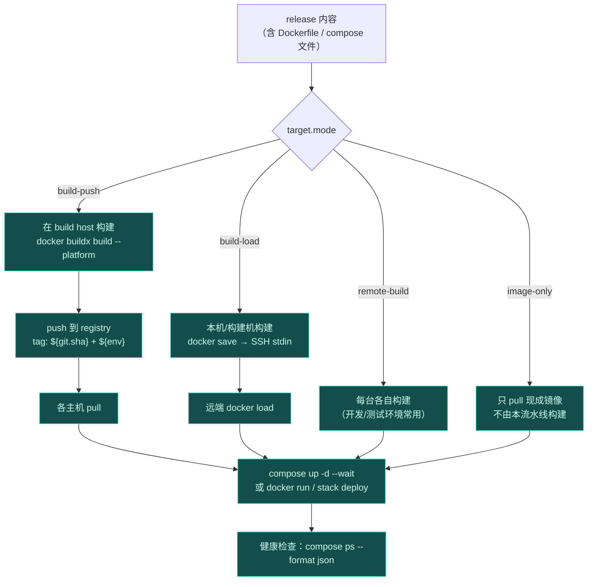
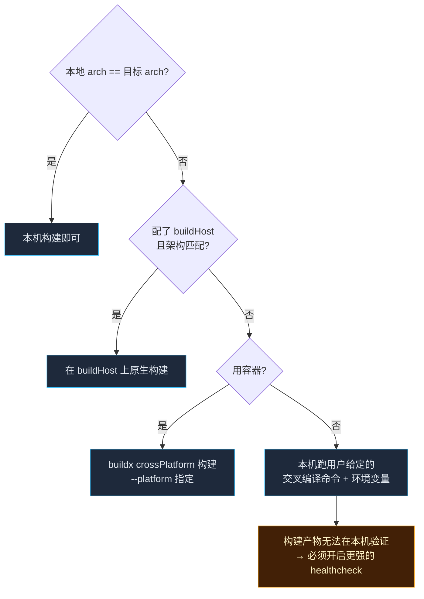

# 配置模型

> 一句话：**最少只需要三个字段就能部署；需要更多控制时，每一层能力都独立可选，不会为了用一个高级功能而把整份配置写长。**

原则：

1. **约定优于配置**：绝大多数字段有安全默认值，能推导的一律推导。**写高级能力不该增加基础用法的复杂度。**
2. **单一真源**：所有字段只在一个 zod schema 里定义；TS 类型、运行时校验、**JSON Schema**（给编辑器提示）全部由它派生。手写第二份类型视为缺陷。
3. **就近覆盖**：profiles 覆盖 defaults，project 覆盖 profile，CLI `--set` 覆盖一切。但**不允许跨层猜测**。
4. **默认值宁保守不激进**：默认不做破坏性动作（`--delete`、覆盖非托管文件、清理旧版本都需要显式开关）。

---

## 1. 最简形态（推荐从这开始）

```ts
// deploy.config.ts
import { defineConfig } from '@dp/config'

export default defineConfig({
  projects: {
    web: {
      source: './dist',          // 要传什么：目录（尾随 / 影响语义）或若干文件
      host: 'prod',              // 传到哪：`hosts` 里的名字
      to: '/var/www/web',        // 远端哪里
    },
  },
  hosts: {
    prod: { ssh: 'deploy@10.0.0.7' }   // ssh 连接串简写形式，等价于 hops: [{...}]
  },
})
```

跑起来：`dp deploy web --env prod`。

**上面的配置里省掉了什么？** 传输方式（自动协商 rsync/tar-ssh/sftp）、target 类型（自动识别，见 §8）、release 布局与回滚（默认开启）、日志脱敏（默认开启）、是否提权（探测后再决定要不要问密码）、CONF passiert 步骤（没有 target 就不需要）。

只有三个字段是真正必填的：**谁（source）、去哪（host）、放哪（to 或 target）**。

---

## 2. 同样的配置，写成 YAML / JSON

完全等价，`dp` 自动按顺序找 `deploy.config.ts | .js | .mjs | .yaml | .yml | .json`，也支持 `--config` 指定：

```yaml
# yaml-language-server: $schema=./.dp/deploy.schema.json
projects:
  web:
    source: ./dist
    host: prod
    to: /var/www/web
hosts:
  prod:
    ssh: deploy@10.0.0.7
```

`dp schema` 会导出 JSON Schema。把它写进 `$schema` 那一行，**编辑器就能做字段名补全、类型校验、悬停文档** —— 这就是「ts/json/schema 保证参数提示」的具体落地。

你也可以不用文件，直接在代码里当库用：

```ts
import { deploy } from '@dp/core'
const result = await deploy({
  projects: { web: { source: './dist', host: 'prod', to: '/var/www/web' } },
  hosts: { prod: { ssh: 'deploy@10.0.0.7' } },
})
```

对象与文件走同一套 schema，不存在「文件里能写的比对象里多」。

---

## 3. 多环境（dev / staging / prod）

三种机制，按复杂度递增，可混用：

### 3.1 profile：同一份配置里的差异层

```ts
export default defineConfig({
  defaults: { release: { keep: 5 } },
  profiles: {
    staging: { hosts: { web: { ssh: 'deploy@stg.example.com' } } },
    prod:    { hosts: { web: { ssh: 'deploy@prod.example.com' } }, release: { keep: 10 } },
  },
})
```

`dp deploy web --env prod`。**没有 `--env` 时必须有明确的默认 profile，否则报错** —— 不猜环境，猜错了就是把预发的东西发到生产。

### 3.2 project × env 的矩阵：多个项目同时多环境

```ts
profiles: {
  prod: {
    projects: {
      web:   { host: 'prod-web',   to: '/srv/web' },
      admin: { host: 'prod-admin', to: '/srv/admin' },
      api:   { target: { type: 'docker', compose: { projectName: 'api' } } },
    },
  },
}
```

`dp deploy --all --env prod` → 一次把整个环境推上去（见 §5 的扇出策略）。

### 3.3 环境变量插值与 secretRef

任何字符串值里可以用变量：

| 写法 | 含义 |
| --- | --- |
| `${env.DEPLOY_KEY}` | 环境变量 |
| `${git.sha}` `${git.branch}` `${git.tag}` | 本地 Git 状态 |
| `${release.id}` `${release.current}` | 运行时才确定，由 template 层在 plan 期解析 |
| `${project}` `${env}` `${now}` | 上下文变量 |

凭据**永远写成 ref，不写明文**：

```yaml
auth: { type: password, passwordRef: env:DEPLOY_PASSWORD }
```

scheme 有 `env:` / `file:` / `prompt:` / `cmd:`，注册表化，未来可加 `vault:` / `op:` —— 见 security.md。

---

## 4. 主机与多跳、提权、传输

```yaml
hosts:
  prod-bastion:
    ssh:
      hops:
        - { ssh: 'ops@jump.example.com', auth: { type: agent }, knownHosts: tofu }
        - { ssh: 'deploy@10.0.0.7',     auth: { type: password, passwordRef: env:DEPLOY_PASSWORD } }
    become:
      type: sudo            # none | sudo | su | doas | custom
      user: root
      method: auto          # auto | nopasswd | stdin | pty
      passwordRef: env:SUDO_PASSWORD
      preserveEnv: false
    transport:
      strategy: auto        # auto | rsync | tar-ssh | sftp | local
      delete: false
    crypto:                 # 见 security.md：抗量子策略逐跳生效
      kexPolicy: pq-preferred   # pq-preferred | pq-required | compat
      warnWeakCrypto: true
    timeouts: { connectMs: 15000, execMs: 120000 }
    knownHosts: strict

  local-box: { local: true }        # 本机目标
```

**设计要点**：`hosts` 描述「怎么过去」，`target` 描述「到了之后怎么生效」，两者正交。所以同一份 nginx 配置，挂 `prod-bastion` 就是远端部署，挂 `local-box` 就是本机部署 —— target 的代码一行不用改。

---

## 5. 多主机 / 集群扇出

一个 project 可以同时投向**多台主机**（集群），`host` 写成数组或 host group：

```yaml
hostGroups:
  prod-cluster: ['prod-web-01', 'prod-web-02', 'prod-web-03']

projects:
  web:
    source: ./dist
    host: { group: prod-cluster }
    rollout:
      strategy: rolling          # all | rolling | canary | serial
      batch: 1                   # rolling 时每批几台
      pauseMs: 5000              # 批间隔
      failPolicy: abort          # abort | continue | ask
      healthWaitMs: 30000
```

| 策略 | 行为 | 适合 |
| --- | --- | --- |
| `all` | 全并行 | 无状态服务、追求最快 |
| `rolling` | 分批，`batch: 1` 时就是逐台 | 有状态 / 要保容量 |
| `canary` | 先一台，验健康后推全量 | 高风险发布 |
| `serial` | 严格串行并在每台之间等待人工确认 | 关键业务的保守节奏 |

扇出的单位要清楚：**一次部署里，每台主机各自算一条独立的 plan**（各自的 Facts 可能不同 —— 机器间 rsync 版本不一样是常事），共用一个 `releaseId`，以便跨机器对齐版本与回滚。`dp releases --all` 能看到每台机器上当前指向的版本，用来判断集群是否一致。

幂等在这里特别值钱：同一 `releaseId` 已在某台机器上存在时，那台机器跳过上传直接参与 activation，跨机重复运行也就安全了。

---

## 6. 容器：动态构建 / 推拉 / 多服务编排

容器场景容易写成一个死板的开关列表，所以这里按「**镜像从哪来**」这条主线组织：



```yaml
projects:
  api:
    source: { root: ./apps/api, include: ['**'], exclude: ['**/node_modules/**'] }
    target:
      type: docker
      mode: build-push              # build-push | build-load | remote-build | image-only
      image:
        name: registry.example.com/team/api
        tags: ['${git.sha}', '${env}-latest']     # 多标签
        platform: 'linux/arm64'      # 交叉构建目标架构（见 §7）
      build:
        where: local                # local | remote | buildHost
        buildHost: builder-arm64    # where=buildHost 时用它
        dockerfile: Dockerfile
        context: .
        cacheFrom: ['type=registry,ref=...']
        buildkit: true
      registry:
        auth: { usernameRef: env:REG_USER, passwordRef: env:REG_PASS }
      compose:
        files: ['docker-compose.yml', 'docker-compose.prod.yml']
        projectName: api
        envFile: .env.prod
        pull: true
        wait: true                   # docker compose up --wait
    healthcheck:
      - { type: command, run: 'docker compose ps --format json', expect: 'running' }
      - { type: http, url: 'http://127.0.0.1:8080/healthz', expectStatus: [200,204] }
```

要点：

- **多容器天然支持**：compose 文件就是多服务定义，我们不重造编排语义，只负责「把文件送过去 + 用正确的 projectName/env 执行 + 验健康」。多主机时每个主机各自 `up`。
- **动态推拉**：`mode: build-push` 时，镜像 tag 由 `${git.sha}` 与 `${env}` 决定，无需手写版本；compose 文件里的镜像引用可以写成 `${image}` 变量，由我们在 plan 期注入（避免 compose 文件里写死 tag）。
- **`image-only`** 是给「镜像由别的流水线做好」的场景留的位置 —— 同一个 target 类型覆盖四种供给方式，而不是四个互斥的 target。
- **默认 `remote-build` 之外都避免依赖本机 docker CLI**：`build-load` 需要本机 docker，`build-push` 若为交叉构建则需要 buildx。缺什么要明确报错 + 建议退到哪里。

---

## 7. 交叉编译

「在哪构建」和「构建出什么架构」是两回事，配置里分开表达：

```yaml
projects:
  edge-agent:
    build:                      # 独立于 source.prepare，是「构建」而非「拷贝」的阶段
      where: buildHost          # local | remote | buildHost | auto
      buildHost: builder-arm64  # 一台架构匹配的构建机
      platform: 'linux/arm64'   # 目标架构
      strategy: auto            # cross | native | buildx
      command: 'make build'     # 非 docker 场景：自己承担交叉编译（GOARCH / --target 等）
      env: { GOOS: linux, GOARCH: arm64 }
      artifact: ./dist/edge-agent
```

推导规则（`strategy: auto` 时）：



有一条硬规则：**交叉编译出来的产物不能在本机验证**。因此 `strategy: cross | buildx` 且没配 healthcheck 时，給出警告（不阻断，但要用户知情）——这是为避免「推上去了才发现跑在错误的架构上」。

---

## 8. 自动识别：不写 target 会发生什么

`target` 不填时走 **TargetResolver**，两个阶段：

1. **探测器（Detector）**：在项目根收集证据。每个探测器返回 `(confidence, evidence[])`。
2. **仲裁**：按「命中数量 + 显式开关」决定，并**打印它为什么这么选**。

| 探测到的证据 | 建议 target |
| --- | --- |
| `docker-compose.yml` / `compose.yaml` / `docker-compose.*.yml` | `docker`（mode: remote-build 或 image-only） |
| `Dockerfile` 且无 compose | `docker`（single image） |
| `nginx.conf` / `conf.d/*.conf` / `*.nginx.conf` | `nginx` |
| `Caddyfile` | `caddy`（后续功能） |
| `*.service` 单元文件 | `systemd` |
| `ecosystem.config.js` | `pm2` |
| `package.json` 有 `scripts.deploy` / `.deploy/scripts/*` | **`delegate`**：交给项目自带的部署方式 |
| 只有静态文件（含 `index.html`） | `static` |
| `Chart.yaml` / k8s manifests | `k8s`（后续功能） |

仲裁策略必须保守：

- **0 命中** → 报错并列出「它看到了哪些文件」，而不是假装 static
- **1 命中** → 用它，日志打印：`检测到 docker-compose.yml → target.type=docker（可用 target.type 覆盖）`
- **多命中** → 默认**报错**（不猜），除非配 `target.pick: highest | first`；报错信息里列出所有候选与排除办法

### delegate：项目自带部署方式

很多项目已经有自己的部署脚本/compose/Makefile，我们不该抢活。此时本项目的角色变成：**在一旁提供版本布局、锁、日志、回滚与验证**。

```yaml
projects:
  legacy:
    target:
      type: delegate
      run: 'npm run deploy'      # 或 deploy.sh / make deploy
      cwd: '.'
```

contract 通过环境变量传给脚本：

```
DP_RELEASE_DIR   /srv/app/releases/<releaseId>
DP_CURRENT_DIR   /srv/app/current
DP_RELEASE_ID    20261001-003000-a1b2c3d4
DP_ENV           prod
DP_HOST_COUNT    3          # 多台时
```

于是「项目自带的方式」与「我们的 release/rollback/audit」各司其职：**沙箱由项目负责，秩序由我们负责。**

---

## 9. 覆盖优先级

```
CLI --set / 参数  >  project 内的 target  >  profiles.<env>.projects.<name>
                 >  profiles.<env>.defaults  >  defaults      （后者被前者覆盖）
```

嵌套对象**深合并**，数组**整体替换**（数组合并的语义永远说不清）。

`dp plan` 会输出「最终生效配置」的解析结果与来源，例如：

```
release.keep = 10        ← profiles.prod.release.keep
transport.strategy = auto ← defaults（本次协商结果：tar-ssh）
```

**每一个生效值都要能解释「它从哪来」** —— 这是配置系统的可调试性底线。

---

## 10. 字段速查表

| 层级 | 关键字段 |
| --- | --- |
| `defaults` / `profiles` | `hosts`、`projects`、`release`、`transport`、`crypto`、`timeouts` |
| `hosts.*` | `ssh`（含 `hops[]`）、`local`、`become`、`transport`、`crypto`、`knownHosts`、`timeouts`、`retry` |
| `projects.*.source` | `root`、`include`、`exclude`、`files`、`dotfiles`、`prepare`（本机前置命令） |
| `projects.*.build` | `where`、`buildHost`、`platform`、`strategy`、`command`、`env`、`artifact` |
| `projects.*.release` | `root`、`keep`、`shared[]`、`owner`、`dirMode`、`fileMode`、`switchStrategy` |
| `projects.*.transfer` | `strategy`、`delete`、`compress`、`checksum`、`bandwidthLimit` |
| `projects.*.rollout` | `strategy`、`batch`、`pauseMs`、`failPolicy`、`healthWaitMs` |
| `projects.*.target` | `type`、`pick` + 各 target 自有字段（`nginx.confd` / `docker.image` / ...） |
| `projects.*.healthcheck` | `command` / `http` / `tcp` / `fileExists` |
| `projects.*.hooks` | `before|after × prepare|transfer|install|activate|verify`，每条带 `where: local|remote` |
| `projects.*.rollback` | `enabled`、`onFailure: auto|ask|never` |

完整字段名以 `dp schema` 导出的 JSON Schema 为准 —— schema 即文档，两者不容许不一致。
