# 图集：全景到细节

> 本文用图把整个系统说清楚。**结构与流程以本文为准**，各文档的文字负责给出理由和取舍。
>
> 阅读顺序：全景 → 分层 → 数据流 → 连接与传输 → 目标落地 → 事务与验收 → 扩展与发布。

---

## 1. 全景

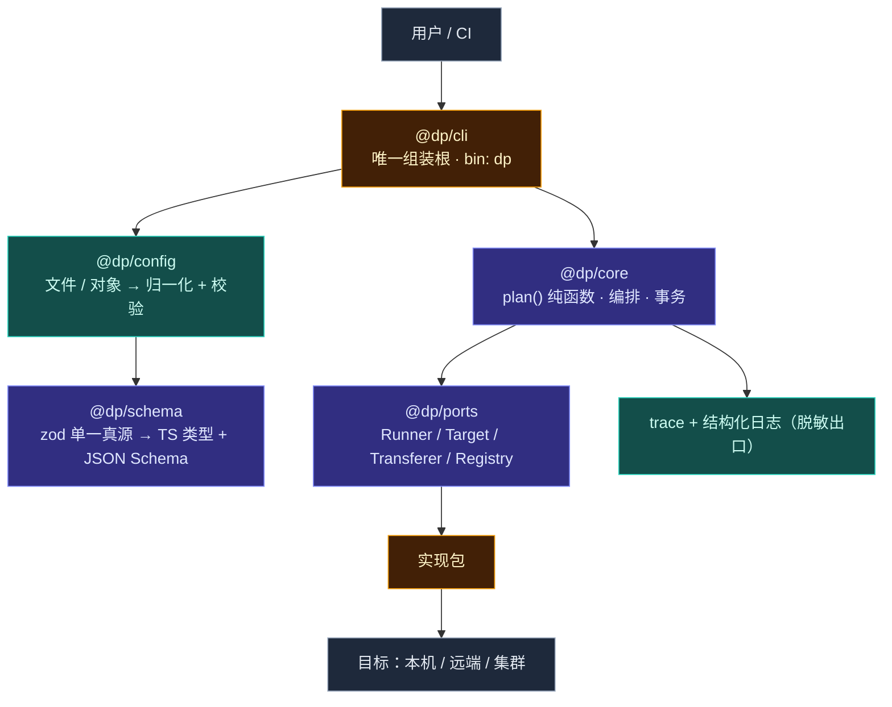

---

## 2. 分层与依赖方向

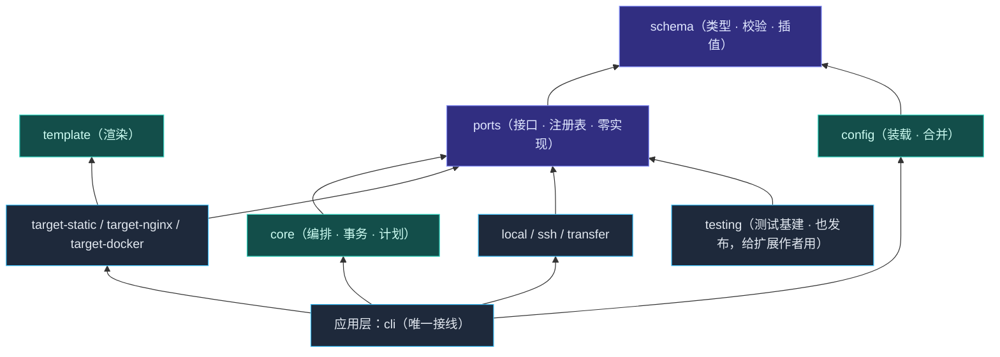

**依赖单向向下。`core` → `ports` → 无**：这就是为什么 core 里不知道 ssh 存在，也是本地目标与远端目标能共用同一条管线的原因。

---

## 3. 配置：从各种来源到一个可校验对象

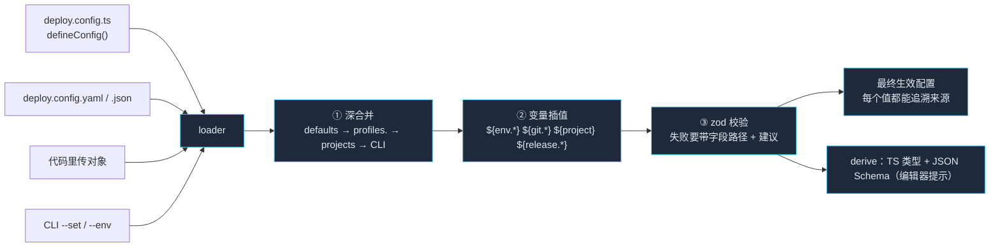

---

## 4. 运行时数据流

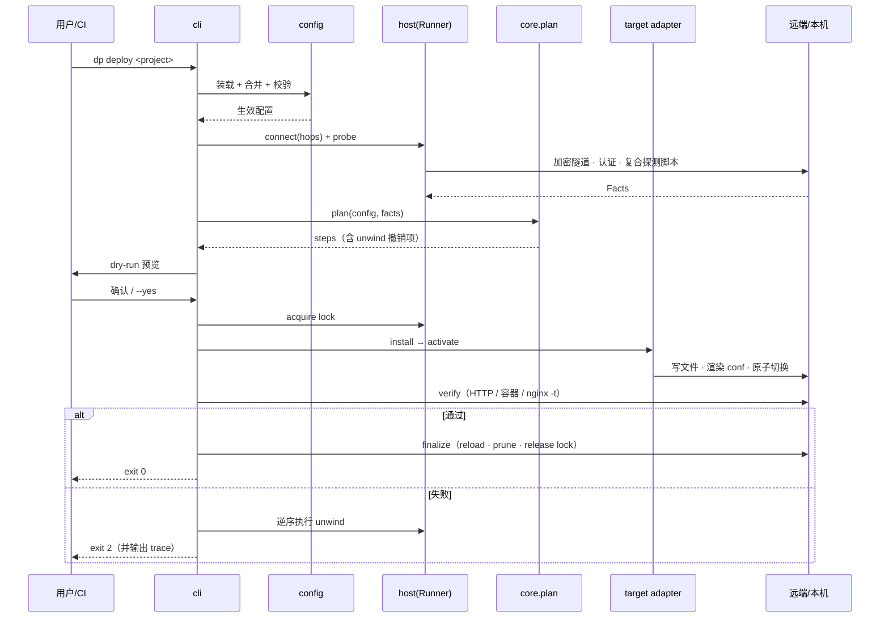

---

## 5. Runner 端口：一个接口，两个世界

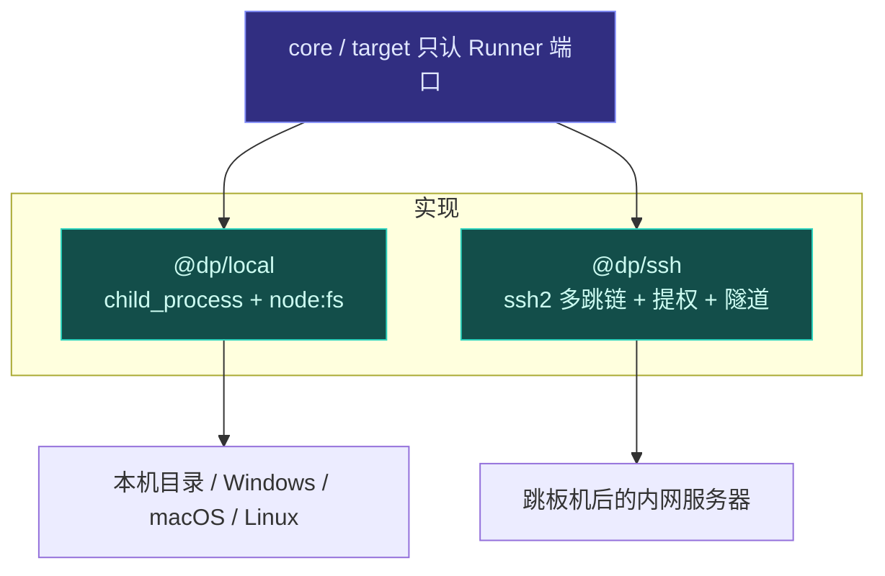

端口能力：`probe` / `exec` / `streamExec` / `shell` / `fs` / `close`。**上层永远不知道对面是本机子进程还是三跳之外的机器。**

---

## 6. 多跳链

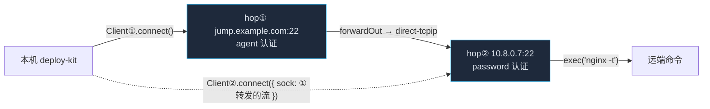

每跳独立：认证、主机密钥、**crypto 协商**（任意一段不抗量子，整条链就被拉低）、超时、保活。关闭必须逆序。

---

## 7. 提权决策

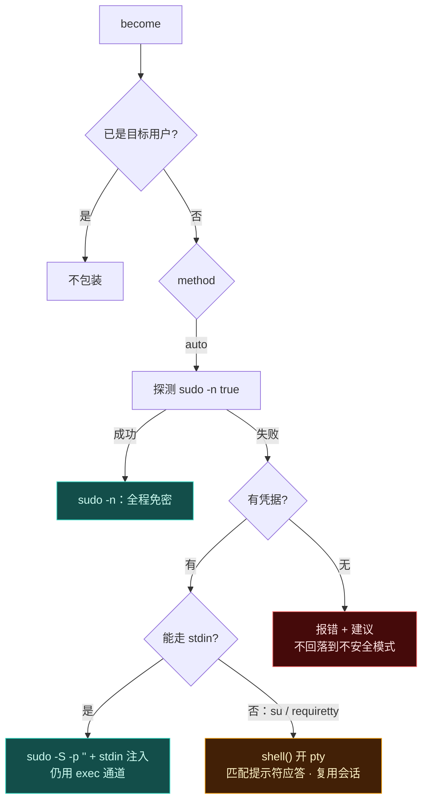

---

## 8. 传输：协商 + 流式流水线

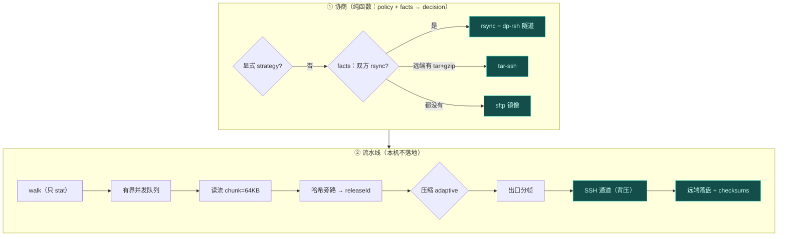

---

## 9. Release 布局与原子切换

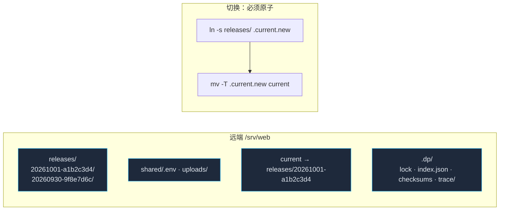

`ln -sfn` 不原子（中间有一帧没有 `current`）。busybox 无 `mv -T`、Windows 无权限建软链时按 Facts 退化到 `rename` / `copy`，**并明确告知这次不是原子切换**。

---

## 10. 目标适配器契约

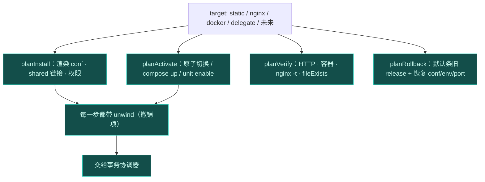

四种落地语义，同一个契约：**干货只差 install 阶段做什么。**

---

## 11. nginx：影子校验 + 两步 `-t`

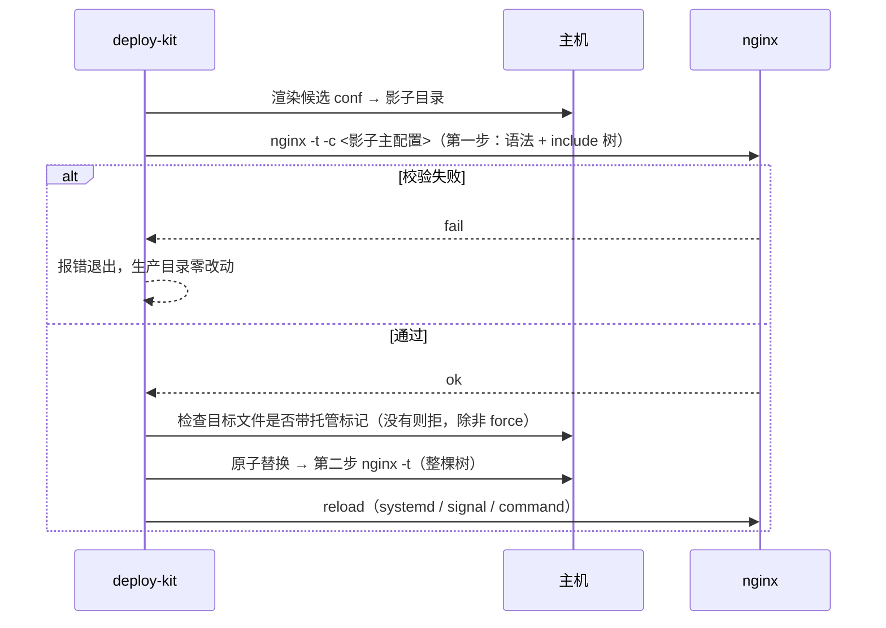

---

## 12. 容器：四种供给方式

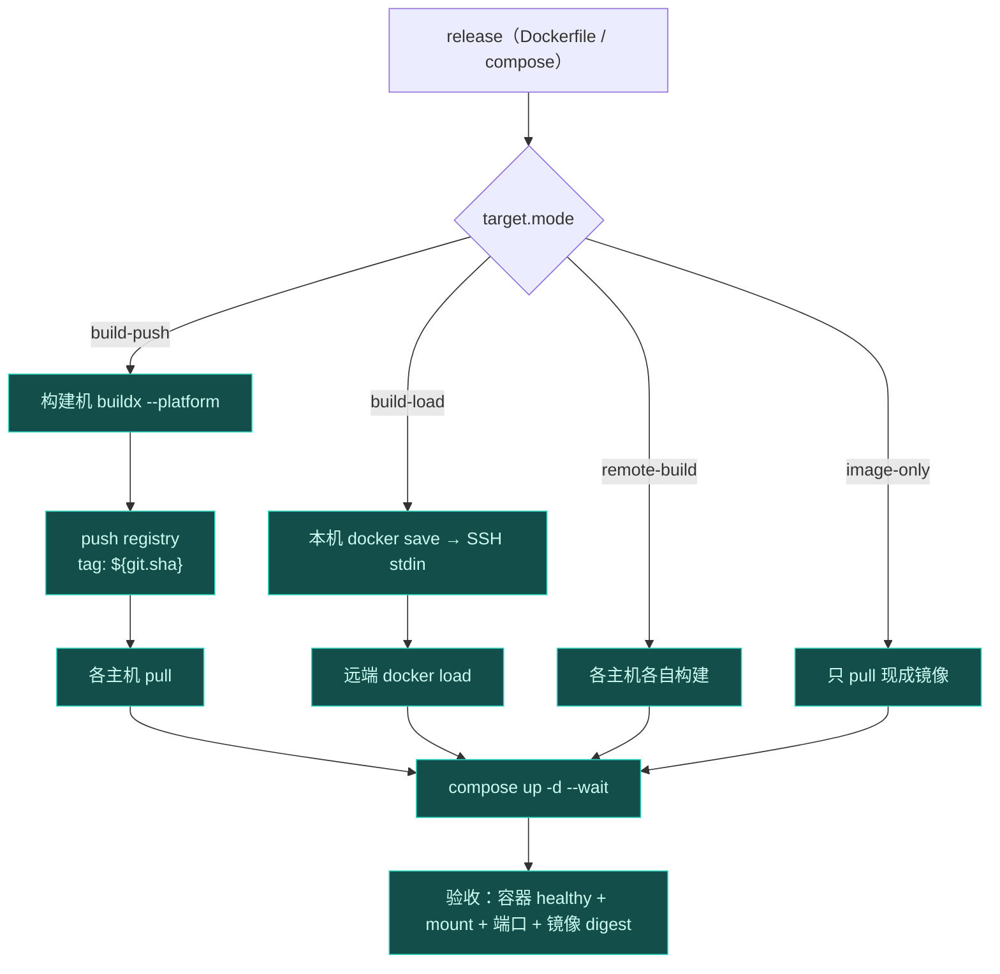

---

## 13. 集群扇出与并发隔离

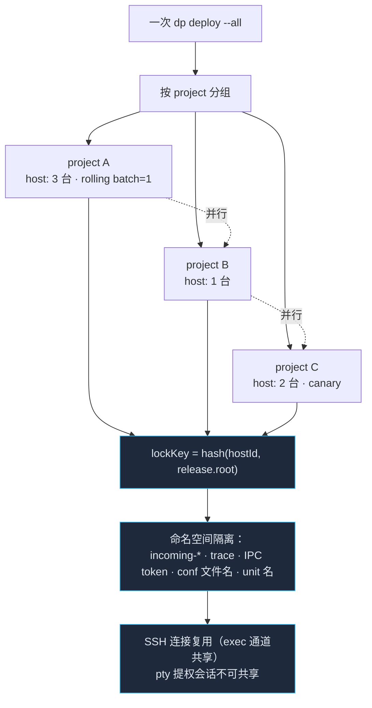

---

## 14. 源产物识别与分流

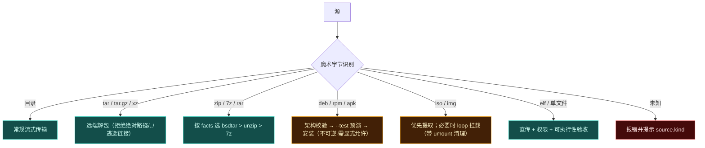

---

## 15. 预检 → 事务 → 验收：三道门

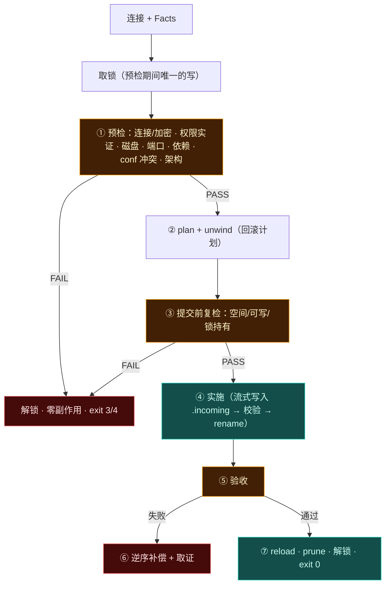

**最好的回滚，是根本不需要回滚**：三条禁令 —— 环境不猜、target 冲突不猜、空间不够不开始。

---

## 16. 事务状态机

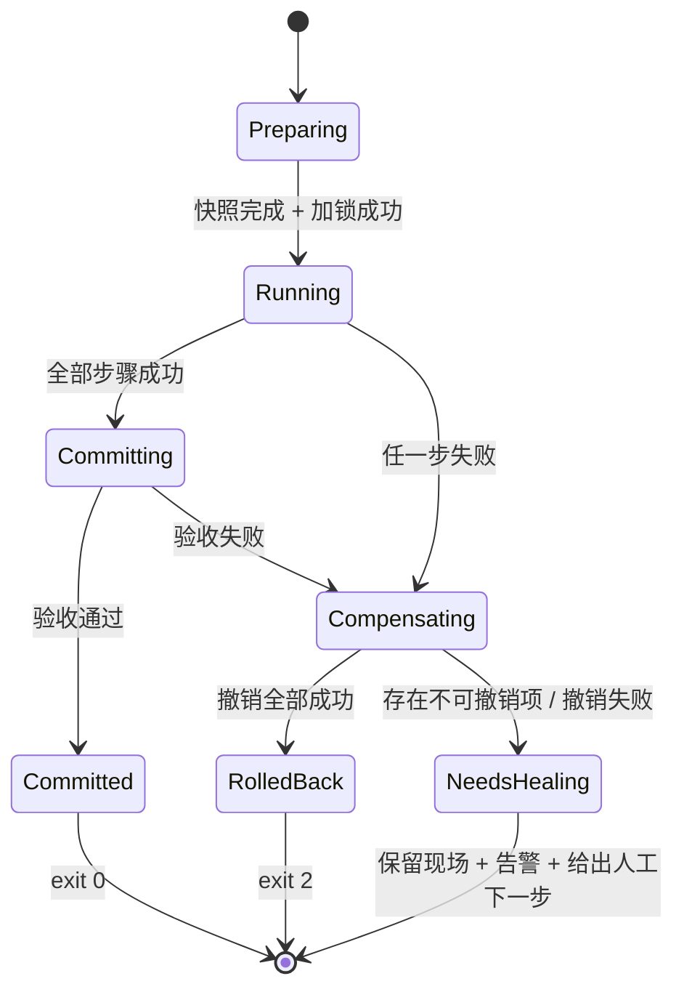

`NeedsHealing` 是诚实承认失败的状态，不允许被吞掉。三类 unwind：`none` / `compensate` / `snapshot` / `irreversible`（后者 plan 期必须显式允许）。

---

## 17. 验收裁决

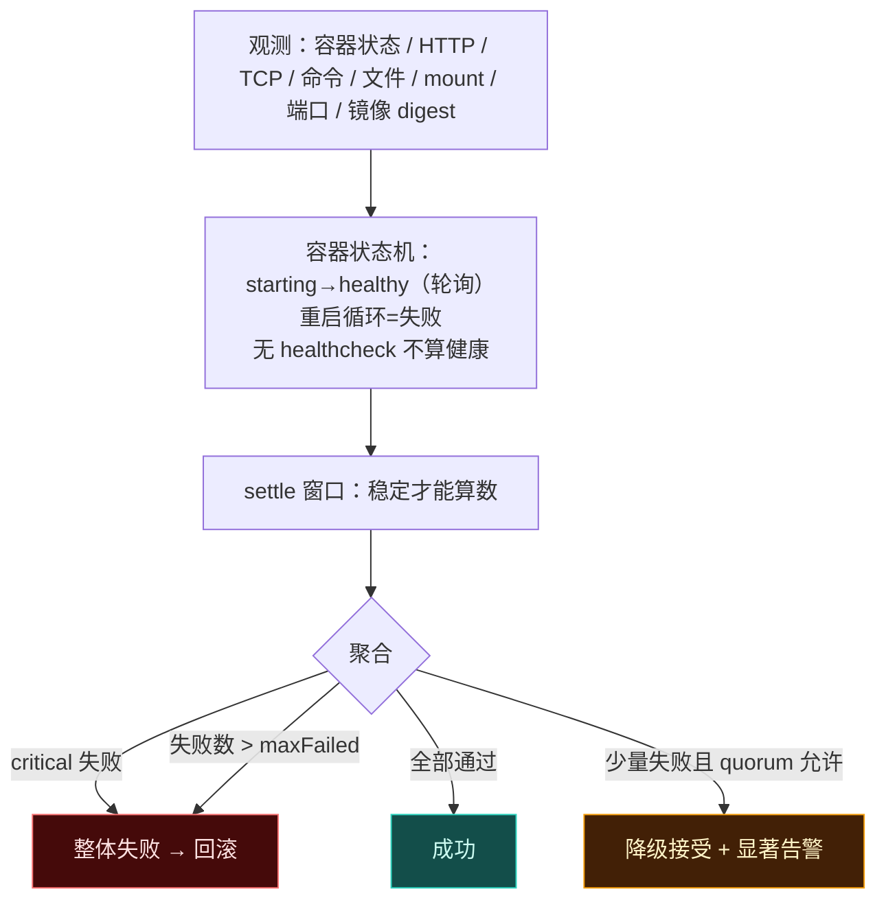

判定逻辑保持**纯函数**（观测 → accept / reject / warn），于是可以像 `plan()` 一样做矩阵快照测试。

---

## 18. 扩展点：按名字查注册表

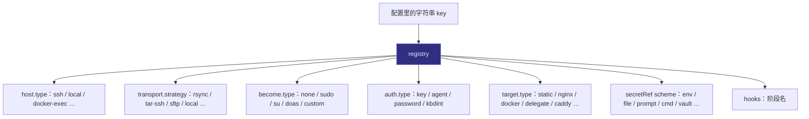

**规则：不许出现 `switch(type)` 的第二个分支 —— 新能力一律是「新包 + 一次注册」。** 同名重复注册默认报错（`allowOverride` 仅给测试用）。

---

## 19. 工程质量门禁与发布

> ⚠️ **这张图画的是目标流水线，不是当前状态**：其中的 eslint、依赖检查工具、死代码检查、
> vitest、ESM/UMD 双产物、包 smoke、changesets **都还没接入**。当前真正跑的只有
> `tsc -b` 与 `node --test`（见 README 的「质量门禁」表）。

`verify` 的顺序不能改：产物层的检查必须在 build 之后。
