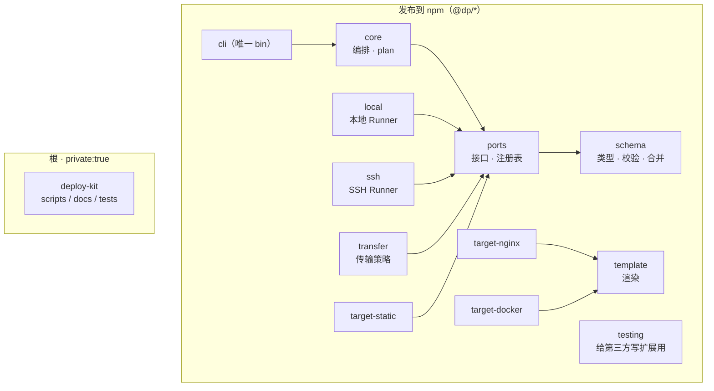

# 发包策略（多包发布到 npm）

> 一句话：**每个包都要能独立安装与独立演进，所以入口、产物、依赖边界必须显式声明 —— 能不能发得出去，是对分层是否合理的一次压力测试。**
>
> ⚠️ **本文的前半是策略设计**：包尚未发布到 npm（`packages/` 下 12 个包全是 `private: true`），
> CI 发布流程未接入。changesets **已接入到「推导版本」这一步**（`pnpm changeset` →
> `.github/workflows/release.yml` 开版本 PR），发布那一跳还差两个前置条件：
> 摘掉 private，以及一个 npm token。文中「要发时按这套来」。

配套：[`DESIGN.md`](./DESIGN.md)（分层与依赖方向）、[`testing.md`](./testing.md)（吓得小孩 regression 门禁）。

---

## 1. 发布单元



判断一个东西该不该是独立的包，看两条：

- **它会不会被第三方单独安装**（`ports` / `testing` 会：写自定义 target 的人只需要它们）
- **它的发布节奏是否与别人不同**（`target-*` 各自演进）

根、`docs/`、`tests/`、`examples/`、`scripts/` 全部 **private**，只 publish `packages/*`。

---

## 2. 每个包的出口约定

```json
{
  "name": "@dp/schema",
  "version": "0.1.0",
  "type": "module",
  "sideEffects": false,
  "exports": {
    ".": {
      "types": "./build/index.d.ts",
      "import": "./build/index.js",
      "require": "./build/index.umd.cjs"
    },
    "./package.json": "./package.json"
  },
  "files": ["build", "README.md"],
  "engines": { "node": ">=22" }
}
```

四条硬性要求：

1. **`exports` 必须写全**，含 `"types"` 条件。只写 `main/module/types` 的包在新的 Node 解析规则下会出问题，而且限制子路径导出更干净（默认不许深路径 import）
2. **`files` 白名单**，不要整包发出去。发之前跑一次 `npm pack --dry-run` 当作 smoke test
3. **`sideEffects: false`**（`cli` 除外）—— 这是 tree-shaking 的前提
4. **`bin` 只出现在 `cli`**，其余包不允许带可执行入口

产物目录沿用参考仓库的 **`build/`**（而不是 `dist/`）：那样 `.gitignore` 一条 `build/` 就够，`clean` 脚本只需认一个名字。**这种一致性本身就是简化的一种形式**，别为了看起来专业多引入一个约定。

---

## 3. 依赖的策略：少而硬

| 依赖 | 位置 | 理由 |
| --- | --- | --- |
| `zod` | `schema` 的**直接依赖** | 版本必须与本包声明的版本一致，跨版本的类型差异会让校验结果漂移；不设 peer 是为了不让用户自己去挑版本 |
| `ssh2` | `ssh` 的直接依赖 | 只有它需要 |
| `tar-stream` 之类 | 对应策略包 | 按需依赖，不为省包而 shared "utils" |
| 内部包之间 | `workspace:*` | 发布时由 changesets 自动改写为 `^x.y.z` |
| Node 内置模块 | 直接用 | 不为了跨运行时引入 polyfill |

一条原则：**不为「看起来合理」增加一个包**。参考资料提到 `dp-utils` 这种通用工具包是典型的坑 —— 它最终会变成所有人的垃圾桶，并制造出实际存在的循环依赖风险。

`ssh2` 的可选原生依赖（`cpu-features` / `nan`）会在安装时触发本地编译。两种处理，选一种并写进文档：

- 在 `.npmrc` 用 `optional=false` 跳过可选依赖（推荐：它们只影响默认 cipher 择优，而我们本来就会显式指定 cipher 列表）
- 或在 `pnpm-workspace.yaml` 的 `onlyBuiltDependencies` 里显式放行这两个包

---

## 4. 版本与发布流程

- **changesets**：每次 PR 附带一个 changeset 描述影响范围；版本号由此自动推导
- **Conventional Commits**：`type(scope)` 里 scope 用包名（`core` / `ssh` / `transfer` / `target-nginx` / ...），加上 `schema`、`ports`、`cli`、`repo`、`deps`
- **CI 发布**：`pnpm changeset publish` 走 GitHub Actions，开启 npm provenance（`--provenance`）以便下游验证包的构建来源
- **稳定性承诺**：`ports` 与 `schema` 是 semver 敏感区（breaking 就升 major）；新 target/transport 包以 `0.x` 起步并标注 experimental，稳定后再升到 `1.0`

---

## 5. 必须的 Smoke 测试

「能不能发得出去」要被测试守着，而不是靠发布时发现：

```ts
// tests/packages-smoke.test.ts —— 对每个包（不 mock）：
//  ① package.json 的 main/module/types/exports 指向的文件真实存在
//  ② 以 CJS 方式 require 能拿到预期的具名导出
//  ③ 以 ESM 方式 import 能拿到预期的具名导出
//  ④ exports 里声明的每个入口都能解析到真实文件
```

这一条极便宜却极有效：**缺 `types` 入口、`.d.ts` 没生成、ESM/CJS 双格式坏了，都会在这里红。**

---

## 6. CLI 包的特殊性

`cli` 是唯一带 `bin` 的包，另外要注意：

- 用 `engines` 明确 Node 版本。考虑到抗量子需要 Node ≥ 24.7 才有底层支持，**建议 `.nvmrc` 指向 24**，而 `engines` 写 `>=22`（22 可用，只是某些 kex 走不了）
- 不要把所有实现都打进 CLI 的 bundle：它依赖 `@dp/*`，让 pnpm/npm 去做，别自己再包一层
- CLI 的输出属于 API：`--json` 事件格式要有定本并纳入测试（CI 依赖它）
