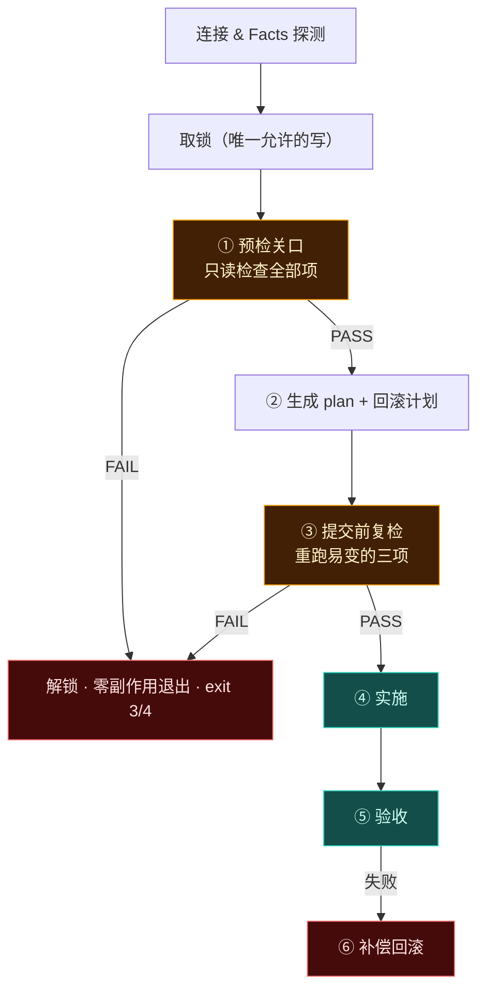

# 部署前预检（Preflight Gate）

> 一句话：**在往目标写入第一个字节之前，把所有可能失败的原因穷举一遍；预检不过就退出，此时一个字节都没动过 —— 回滚根本不需要触发。**

配套：[`transaction.md`](./transaction.md)（事务与补偿）、[`verify.md`](./verify.md)（部署后的验收 — 注意两者分工相反）、[`config.md`](./config.md)。

**预检（事前）和验收（事后）是互补的两道门：**

| | 时机 | 副作用 | 目的 |
| --- | --- | --- | --- |
| **预检** | 写之前 | 只读（唯一例外是那个锁） | **不要开始**一件注定失败的事 |
| **验收** | 写之后 | 可能触发回滚 | 确认刚做完的事能不能留下 |

---

## 1. 关口位置



**为什么锁要在预检之前取？** 因为并发部署时，两台 CI 可能各自预检通过、然后一起写。锁是互斥的前提。它必须是预检期间**唯一的写操作**，并且预检失败时立刻释放（释放写在 `finally` 里，见 transaction.md）。

---

## 2. 预检清单

每一项都回答三件事：检查什么、怎么检查、什么条件下 FAIL。

### 2.1 连接与身份

| 项 | 怎么查 | FAIL 条件 |
| --- | --- | --- |
| 每一跳可达与认证 | 逐跳建立并执行 `true` | 任一跳失败 → 报出 hopIndex |
| 主机密钥 | 校验或 TOFU 记录 | 指纹不匹配 → **永不自动放行** |
| 加密强度 | 逐跳协商结果 | `kexPolicy: pq-required` 下任一段非 PQ → FAIL |
| 实际登录身份 | `id -un` / `id -u` | 与预期不符（某些跳板会把你映射成别的用户） |

### 2.2 远端能力

| 项 | FAIL 条件 |
| --- | --- |
| rsync / tar / gzip / sha256sum 存在与版本 | 协商出的传输策略所需工具缺失 → 直接说明该降级还是报错 |
| nginx / docker / systemctl 是否存在 | target 依赖的核心工具缺失 |
| shell 能力（`ln -s`、`readlink`、`install`） | 原子切换所需命令缺失 → 提前告知会退化到非原子策略 |

### 2.3 权限（最容易「看着有其实没有」的一类）

**不能用「我是不是 root」来推断，要逐条用无害命令实证：**

| 能力 | 试探方式 | 说明 |
| --- | --- | --- |
| `release.root` 可写 | 在一个临时文件上 `touch` 后立即删除 | 只读挂载 / SELinux / ACL 都能让这里失败 |
| 可创建符号链接 | 在 tmp 里 `ln -s` 再删 | Windows 或受限环境可能不允许 → 提前决定 `switchStrategy` |
| 可否 `chown` 到目标 owner | `getent passwd www-data` 存在性 + 试 chown 一个自己建的临时文件 | **目标是先把 owner 存在性查出来**，否则部署到一半才发现改不了属主 |
| 提权可用性 | `sudo -n true` / `su -c 'true'` 的成败 | 决定这条部署会不会需要密码 |
| confd 可写 | 用带随机后缀、必将被删除的临时文件名试探 | 常见坑：confd 是只读挂载、或属于别的用户 |
| **状态目录链可写且未被抢占** | 逐层校验 `/var` → `/var/lib` → `/var/lib/dp` 的 owner 与写权限 | 租约锁若可被他人伪造，等于永久阻塞所有部署（可用性攻击，不只是权限问题） |
| **带外脚本目录链安全**（仅 `--with-rescue`） | 逐层校验 `/` → `/usr` → `/usr/libexec` → `/usr/libexec/dp` 均为 root 拥有且非 group/other 可写 | **不合格即拒绝安装**，报 `DP.SEC.RESCUE_UNSAFE_PATH`；这是提权面，不能降级为警告（见 `failures.md` §7.1） |

试探文件必须在同一个 try 里创建并删除，且路径带随机后缀，避免留下垃圾。

### 2.4 磁盘与资源

```
need  = sourceSize × (1 + expandFactor)          # tar 解压/容器层的膨胀
      + releaseSize × (keep + 1)                 # 保留版本要占的空间
      + imageLayerSize（容器场景）
needSafe = need × 1.2                            # 安全系数
```

| 项 | FAIL / WARN |
| --- | --- |
| 可用空间 ≥ `needSafe` | 不足 → **FAIL**（写到一半磁盘满是灾难，且回滚也难） |
| inode 数量充足 | 大量小文件场景（node_modules 那种）→ 不足则 FAIL |
| 可用内存 ≥ 容器所需 | 容器场景，不足 WARN（拉不起来会在验收阶段暴露） |
| 目标分区不是只读 | FAIL |

**容器场景要额外算镜像层**：`docker pull` 的层数空间远比包大小可观，很多人就是在这里把磁盘撑满的。

### 2.5 目标端配置预检（替换能否成功）

这是「配置文件替换」能不能安全发生的关键：

| 项 | 怎么查 |
| --- | --- |
| conf 文件是否可写/是否被托管 | 存在且**没有我们的标记** → FAIL（除非 `force`） |
| **候选配置本身合法** | 影子目录 + `-c` 跑 `nginx -t`（连 -t 都不用碰生产目录） |
| listen/server_name 与其他站点冲突 | 扫描 confd 里的其他文件做粗粒度比对（同端口不同 server_name 是允许的，完全重复则 WARN/FAIL） |
| reload 命令可用 | `systemctl is-enabled nginx`、`nginx -s reload` 的 dry 可用性 |
| 目录取代符号链接（反之） | `current` 当前是目录还是软链接、类型冲突要提前发现 |

### 2.6 容器专属预检

| 项 | 方式 |
| --- | --- |
| compose 文件合法 | `docker compose config -q`（**只校验不执行**） |
| 镜像可获得 | `docker manifest inspect`（不真的 pull）判断 tag 存在性与 registry 凭据是否有效 |
| 端口冲突 | `ss -ltnp` 对比 compose 声明的宿主端口 |
| 卷源路径存在且有正确权限 | 逐条 stat —— 这是「容器起来了但卷是空的」的唯一事前防线 |
| 卷的 SELinux 标签 | RHEL 系上 `:z` / `:Z` 是否存在 |
| 资源限制可执行 | 内存/CPU 限制与可用资源比对 |

### 2.7 集群与幂等

- **逐台执行以上全部**，然后按 `quorum` / `maxFailed` **预判**：若已知失败数超过容忍度，**在写之前就停手**
- releaseId 已存在时：先验 `.dp/checksums.txt` 完整性，决定「跳过」还是「修复」，不要盲目重传

---

## 3. 预检报告

输出是一张能一眼扫完的表，每项 PASS / WARN / FAIL + 依据 + 建议：

```
预检  prod-web (10.0.0.7)
  ✔ 连接：2 跳可达（jump → 10.0.0.7）
  ✔ 加密：段① mlkem768x25519-sha256(PQ)  段② sntrup761x25519-sha512(PQ)
  ✔ 传输：协商 tar-ssh（本机无 rsync）
  ✔ 权限：可写 /srv/web、可 chown www-data、可 ln -s
  ✔ 空间：需要 320MB，可用 4.2GB（含保留版本与安全系数）
  ✔ 配置：候选 nginx conf 通过 nginx -t；confd/web.conf 已带托管标记
  ⚠ 资源：可用内存 380MB，容器声明 limit 512MB
  ✘ 端口：8080 已被 docker-proxy 占用（compose 未描述的残留）

  1 项失败 → 未做任何写操作就已退出（exit 4）
```

两条规则：**WARN 默认不阻断**（`--strict` 下视为 FAIL），**FAIL 必须在 Before-PRE的输出式里给出「怎么修」的建议**，而不是只报一个现象。

---

## 4. 提交前复检（Commit Gate）

预检通过不等于实施时依然成立 —— 中间可能有别的东西占满磁盘、拿走端口、删了目录。所以在真正的写入之前，重跑**三项易变检查**：

1. 可用空间仍满足 `needSafe`
2. 目标根目录仍可写、仍是自己管理的那个（没被换掉）
3. 锁仍然被自己持有（没有被自愈逻辑判定为陈旧并接管）

这三项很快，但能拦住一类非常恶心的现场：**预检全绿 → 跑到一半磁盘满 → 触发回滚 → 回滚也因为没空间而失败。** 提前一秒发现，远比事后 compensation 干净。

---

## 5. 失败时的保证

预检 FAIL 的保证要写死在文档里，也写进测试：

- **零副作用**：未创建任何 release 目录、未写入任何 conf、未 pull 任何镜像、未 reload 任何服务
- **唯一例外是那个锁**，且它在退出前被释放（因此「残留锁」只可能是进程被 kill 的情况，由 TTL 自愈兜底）
- **回滚不需要触发**：因为没有东西需要回滚 —— 这是本节标题「部署失败自动回滚一次都不触发」的正解：**最好的回滚，是根本不需要回滚**

---

## 6. 配置与测试

```yaml
preflight:
  strict: false              # WARN 是否视作 FAIL
  diskSafetyFactor: 1.2
  expandFactor: 0.2
  checkPorts: true
  checkVolumes: true
  validateConf: true         # 影子 nginx -t
  onFail: abort              # abort | report-only（report-only 仅供排查使用）
```

测试怎么做（`testing.md` 的 L1/L3 层）：

- 每一项预检是一个**纯函数或只读 probe**，注入 Facts + 假 Runner 就能测
- **矩阵测试**：对每一项单独注入「失败」，断言 `plan()` 不产生任何 `write` 类步骤、退出码为 `3/4`、且假文件系统字节级未变（与 transaction.md 的回滚矩阵同一个断言风格）

把「它可能失败」的清单写进代码，机器就不会在被叫醒时才想起还有一件事没检查。
