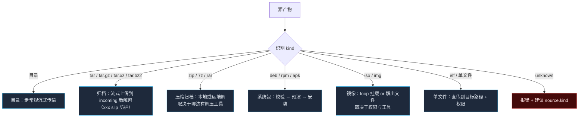

# 源产物：归档 / 包 / 镜像的处理

> 一句话：**输入不一定是一个目录。它可能是一个 tar.gz、一个 deb、一个 ISO —— 所以「先把文件送过去」和「送过去之后怎么落地」必须分开谈，后者取决于产物的 MIME 类型而不是扩展名。**

配套：[`transport.md`](./transport.md)（传输通道）、[`transfer-streaming.md`](./transfer-streaming.md)（流式上传）、[`preflight.md`](./preflight.md)（安装前校验）、[`transaction.md`](./transaction.md)（哪些步骤不可逆）。

---

## 1. 识别：靠魔术字节，不靠扩展名

扩展名会说谎（`latest.tar.gz` 可能是目录打的包，也可能是 `.tgz` 的 npm 包；`.zip` 可能是 jar/apk/jad?）。统一读源文件的**前若干 KB**（不读全文，不下任何一个依赖）做识别：

| 魔数 | 判定 | 典型产物 |
| --- | --- | --- |
| `1F 8B` | gzip（再解一层看是不是 tar） | `.tar.gz`、`.tgz` |
| `FD 37 7A 58 5A` | xz | `.tar.xz` |
| `42 5A 68` | bzip2 | `.tar.bz2` |
| `ustar` @ 257 / `ustar\0` @ 257 | tar | `.tar` |
| `50 4B 03 04` | zip | `.zip`、`.whl`、`.jar`、`.apk`(Android)、`.docx` |
| `37 7A BC AF 27 1C` | 7z | `.7z` |
| `52 61 72 21` | rar | `.rar` |
| `7F 45 4C 46` | ELF 可执行文件 | 单二进制（Go/Rust 出品很常见） |
| `21 3C 61 72 63 68 3E` (`!<arch>`) | ar 归档 | **`.deb`**、`.a` |
| `ED AB EE DB` | rpm | **`.rpm`** |
| `43 44 30 30 31` (`CD001`) @ 32769 | ISO9660 | **`.iso`** |
| Docker tar layer marker | docker save 产物 | 镜像归档 |
| 什么都不匹配 | 未知 | 按 `unknown` 处理，要求用户显式指定 `source.kind` |

`kind` 可被显式覆盖（`source.kind: deb`）—— **自动识别出错时总是允许人工纠正**，而且 rectification 要记录在 trace 里。

---

## 2. 六类源的处理方式



### 2.1 目录

常规路径：流式传输 + `current` 原子切换（见 transfer-streaming.md）。

### 2.2 tar 系列tar.gz / tar.xz / tar.bz2 / tgz）

两种合法落地方式，**选择权交给配置而不是猜**：

| 方式 | 做法 | 优点 | 缺点 |
| --- | --- | --- | --- |
| **远端解压**（默认） | 流式上传到 `releases/<id>/`，远端 `tar -xf` 展开到子目录 | 本机不用卸 압력ressed(to skip CPU)、不吃本机磁盘 | 远端必须有匹配的解 tar 工具 |
| **本地解后再传** | 本机解成目录再走常规流式 | 远端工具不受限 | 吃本机 CPU 与**临时磁盘** —— 与「不在本机落地」原则冲突，必须 opt-in |

解压时的三个安全红线（这是 tar 解包最经典的漏洞来源）：

1. **拒绝绝对路径成员**（`/etc/...`）与含 `..` 的成员（**tar slip**，CVE 类）
2. **拒绝指向解包目录之外的符号链接成员**与硬链接指向外部
3. **可选清理**：`--no-same-owner` 决定是否保留归档内的属主（跨机器 GCफ的 uid 映射不对会出大问题，默认**不保留**，由 `release.owner` 统一设置）

### 2.3 zip / 7z / rar

- **zip 不保留 Unix 权限**（这在部署场景里很致命），所以需要额外的 `fileMode/dirMode` 兜底，并在 plan 里标注「此产物携带的权限信息不完整」
- 工具可用性由 Facts 决定：`unzip` / `bsdtar` / `7z` / `7za` / `unrar`。**优先级 `bsdtar` > `unzip`**：它同时吃得下 zip/7z/rar 且对权限处理更一致
- 都没有 → 明确报错并建议本机解 catsup；不要默默用 python fallback

### 2.4 deb / rpm / apk（系统包）

这类入口子.vb不同：它不是「放文件」，而是**交给系统的包管理器**，于是 Attack挡板 checklist 要变：

| 步骤 | 干什么 | 命令示例（示意） |
| --- | --- | --- |
| **① 架构校验** | 包的 arch 必须匹配 Facts 里的机器架构 | `dpkg --info` / `rpm -qp --qf '%{ARCH}'` |
| **② 依赖预演** | **试运行而不真装**，提前暴露缺依赖 | `rpm -Uvh --test`、`dpkg -i --dry-run`、`apk add --simulate` |
| **③ 签名/校验和** | 给了 sha256 就先验；给了 GPG 且远端有 keyring 就验签 | 自带的 checksums / `rpm -K` |
| **④ 安装** | 真装 | `rpm -Uvh`、`dpkg -i`、`apk add --allow-untrusted`（仅当用户显式允许） |
| **⑤ 验证** | 版本是否已切换生效 | `rpm -q`、`dpkg -l`、`apk info` |

三条重要判断：

- **`--test` / `--dry-run` 是这一类的「预演」，与全局预检同一精神**：先知道会不会失败，再决定要不要开始
- 包安装属于 **不可逆**（见 transaction.md 的分类）：它改变系统状态，`dpkg/rpm` 自身的回滚能力有限。所以默认要求显式配 `allowSystemPackage: true`，或者**优先推荐**：容器 / 归档部署，而不是往机器上装包
- `apk add` 与 `dpkg -i` 的依赖策略差异巨大：前者会联网拉依赖，后者不会。**联网拉依赖意味着失败原因可能在远端网络** —— 因此这类部署必须携带更强的验收 + 明确的失败取证

### 2.5 iso / img

镜像文件的落地方式取决于目标环境的权限与工具，永远**优先不需要 root 的那条路**：

| 方式 | 条件 | 备注 |
| --- | --- | --- |
| **BSD tar 提取** | 远端有 `bsdtar` | 最干净，不需要挂载、不需要权限 |
| **7z 提取** | 远端有 7z | 次之 |
| **loop 挂载** | 必须提权 且 远端有 loop 设备 | `mount -o loop`；需要 loop 设备空闲、SELinux 允许 —— **必须由 `-Wall` 预检确认可用**再采纳 |

挂载方式还有额外的收拾责任：用完必须 `umount`，且要保证异常路径也卸载（它是ulsionsillard resource,不是文件）。所以它进入 plan 时要带明确的 `cleanup` 步骤（在 transaction 的补偿链里）。

### 2.6 单文件 / ELF

最简单：直传到目标路径，然后按 `fileMode`（默认 `0755`）设置权限。需要注意：

- 目标路径要么显式给 `source.to`，要么由 target 决定（比如 nginx target 不管这个）
- 传上去之后建议立即 `--version`/`--help` 之类 dry 运行做一次**可执行性验收**（交叉编译的产物在这里最常暴露架构错误）

---

## 3. 统一的预检项（任何 kind 都要过一遍）

| 检查 | 说明 |
| --- | --- |
| 识别结果与期望一致 | 显式配了 `source.kind` 时做一致性校验 |
| 校验和 / 签名 | 给了就验，验不过直接失败 |
| **架构匹配**（deb/rpm/ELF） | 包/二进制的架构 vs Facts 的 `os.arch` —— 这一条能挡住绝大多数交叉编译事故 |
| 所需工具齐全 | 解压/安装工具缺失要提前说，而不是安装到一半才发现 |
| 磁盘与 inode | 解包后的体积往往远大于压缩包本身，按膨胀系数估算（见 preflight.md） |
| 目标路径合法性 | 绝对路径校验、`..` 拒绝、release.root 之内 |

---

## 4. 配置示例

```yaml
projects:
  agent:
    source:
      kind: auto                 # auto | dir | tar | zip | deb | rpm | apk | iso | file
      files: ['dist/agent-linux-arm64.tar.gz']
      checksum: { algo: sha256, expect: '${env.AGENT_SHA256}' }
      expectArch: 'arm64'        # 与 Facts 校验，交叉编译场景强烈建议写
      unpack:
        where: remote            # remote | local
        into: 'agent'            # 解到 release/<id>/agent
        stripComponents: 1
        keepOwner: false         # 不沿用归档内的属主
        rejectUnsafeMembers: true   # 绝对路径 / .. / 逃逸链接
      perms: { fileMode: '0644', dirMode: '0755', execPatterns: ['bin/*'] }
```

---

## 5. 怎么验

| 测试 | 断言 |
| --- | --- |
| 魔术字节识别 | 每种格式放一个夹具 + **故意错名的文件**（`.tar.gz` 实际是 zip），断言按魔术字节而 ayudacon 🈵 kararı作出了判断 |
| tar slip 防护 | 构造含 `../../../etc/passwd`、`/etc/cron.d/x`、逃逸软链接的归档 → 断言被拒且**没有任何文件写出的事实**（不仅报错，文件系统字节级未变） |
| deb/rpm 预演 | 假远端响应 `--test` 失败 → 断言**根本没有调用真正的安装命令** |
| 架构不匹配 | arm64 包装到 amd64 Facts → 预检失败且「零副作用」 |
| 工具缺失降级 | Facts 里去掉 `bsdtar` → 断言改走 `unzip`/报错路径，并在 plan 里体现 |
| ISO 卸载责任 | 挂载路径注入失败 → 断言 cleanup/umount 步骤仍在执行序列里 |

最后一条是这一类源的特殊性：**资源泄漏比写错文件更隐蔽**，所以它必须被列入 plan 的必然执行序列，而不是靠 `try/finally` 的心情。
