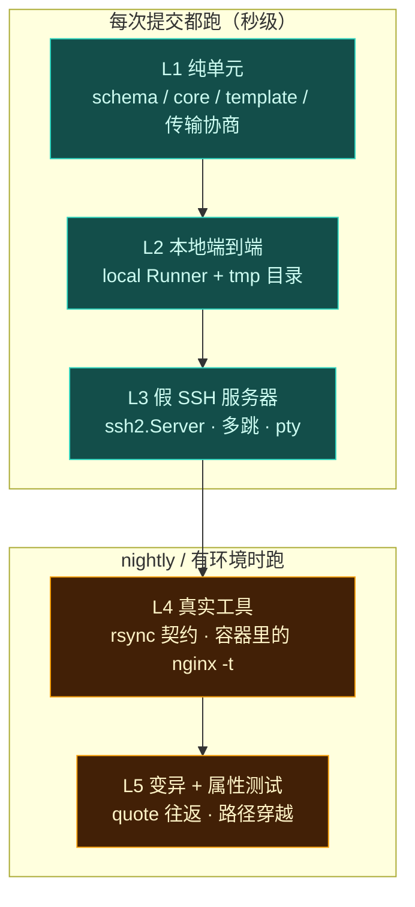

# 测试策略

> 一句话：**如果测试需要真 SSH 服务器才能跑，那说明抽象错了；如果覆盖率 100% 但没人能说出某个断言在保护什么，那说明测试是假的。**

---

## 1. 为什么这套设计天生可测

三个刻意的设计选择，让「部署」这种天然依赖外部环境的系统变得可以在毫秒级验证：

| 设计 | 带来的测试能力 |
| --- | --- |
| **`plan()` 是纯函数**（`config + facts → steps`，无 IO） | 不需要任何机器就能断言「将会执行什么」。所有 host × target 组合都能做成快照对比 |
| **`Runner` 是端口而非实现** | 用内存 FS 的假 Runner 跑完整管线；本地 Runner 直接在 tmp 目录跑真端到端 |
| **`ssh2` 自带服务端实现** | 起一个进程内 SSH 服务器，多跳、pty 提权提示符、认证失败、断连全部可伪造 |

配套两条纪律，它们才是这套能力不腐化的保证：

- **禁止使用失眠导致 skip**：任何一个被跳过的集成测试必须打印原因（`本机无 rsync：已在 P3 用假端验证降级路径`），CI 里汇总 skip 列表，杜绝「skip 变成垃圾桶」
- **覆盖率是入场券不是结论**：参考项目的经验很直白 —— 四项 100% 也可能全是假测试。真正验守护强度的手段是**变异测试**：故意改坏源码跑全量，红 = 真守着，绿 = 形同虚设

---

## 2. 五层测试



---

## 3. L1：纯单元（最重要的一层）

**目标：这四个包必须达到四项 100%。**—— 它们没有任何 IO，没有理由低于这个数。

| 包 | 测什么 | 典型断言 |
| --- | --- | --- |
| `schema` | 归一化、profile 深合并、数组替换语义、变量插值、错误路径 | `mergeProfile(base, prod)` 得到预期对象；缺 `source` 时报 `DP.CONFIG.INVALID` 且 path 是 `projects.web.source` |
| `core.plan` | **黄金快照**：`(config, facts) → steps` | 给定 facts，产出的 steps JSON 与 `__snapshots__/plan-nginx-ssh-sudo.json` 完全一致 |
| `core` 编排 | releaseId 幂等、keep N、回滚指向、锁逻辑 | 同内容两次部署 releaseId 相同；`keep: 2` 时 pruned 列表正确且永不含 current/previous |
| `template` | nginx conf 渲染、变量求值、危险字符 | 反代 location 自动带齐 `Host`/`X-Forwarded-*`；`su -c` 的引用转义正确 |

### 3.1 路径推导：纯单元，不需要任何机器

布局推导和 release 目录推导都是 `(platform, layout, capabilities) → path` 的**纯函数**，天然可全量覆盖：

| 断言 | 说明 |
| --- | --- |
| `deriveLayout(facts)` | `{linux,darwin,win32,freebsd} × {root, sudo, none}` 各给一组注入 facts，断言布局正确 |
| `pickReleaseRoot(...)` | 候选序列**逐条 mock `canWrite`**，断言取首个通过者；全不可写时报 `DP.PATH.*` 而不是静默挑一个 |
| 推导过程可打印 | 断言 plan 输出里含**跳过原因**（"`/srv/x` 不可写：只读挂载"），不是只有最终值 |
| 覆盖优先 | 显式 `release.root` 时**不调用**推导，但仍走 `canWrite` 实证 |

**跨平台路径校验**（大小写敏感性 / 保留名 / 非法字符 / 长度上限那四条）同样纯单元，用夹具文件树即可：

```ts
it('拒绝仅大小写不同的路径', () =>
  expect(() => checkPaths(['a.js', 'A.js'], 'win32')).toThrow('DP.PATH.CASE_COLLISION'))
it('拒绝 Windows 保留名', () =>
  expect(() => checkPaths(['aux.txt'], 'win32')).toThrow('DP.PATH.RESERVED_NAME'))
```

各平台各配一组夹具，**不需要真的 Windows 机器** —— 这正是把校验放进预检而非运行时的收益。

关键技巧 —— **plan 的矩阵快照**：

```ts
// tests/plan.matrix.test.ts
const hosts = ['local', 'ssh-single', 'ssh-multihop-sudo', 'ssh-su-pty']
const targets = ['static', 'nginx', 'docker-compose', 'docker-image']
for (const h of hosts) {
  for (const t of targets) {
    it(`plan: ${h} × ${t}`, async () => {
      const facts = await loadFixtureFacts(h)     // 注入的 Facts，不含任何 IO
      const plan = await makePlan({ config: fixtureConfig(t), facts })
      expect(plan).toMatchFileSnapshot(`__snapshots__/plan-${h}-${t}.json`)
    })
  }
}
```

十六个组合，**没有一个需要网络**。这就是 plan 纯函数换来的东西。人改了 plan 逻辑，快照 diff 会精确指出「第 7 步从 `ln -s` 变成了 `cp -r`」。

---

## 4. L2：本地端到端（最接近真的一次)

用 `@dp/local` Runner，把整条管线跑在一个临时目录里：

```ts
const dir = await mkdtemp(join(tmpdir(), 'dp-'))
const runner = createLocalRunner()
await runDeploy({ config, runner, root: dir })
// 然后直接读文件系统断言
expect(await readlink(`${dir}/current`)).toBe(`releases/${releaseId}`)
// 再断言幂等：第二次跑不应产生新的 release 目录
```

这一层能抓到的 bug 类型非常值钱：释放布局错、prune 逻辑错、`current` 悬空、activate 非原子。而且它在 **Windows / macOS / Linux 都能跑** —— 顺便成为跨平台兼容性的一道防线。

nginx 类 target 在这一层把 reload 命令替换成 recording 命令（`activate -> echo` 由 fixture 注入），即所谓的「recording Runner」：**记录每一条被执行的 argv 而不真执行**。它是 dry-run 与真跑之间的中间态，比 dry-run 强在它真的走了 exec 通道。

---

## 5. L3：假 SSH 服务器（本项目测试能力的最大来源）

`ssh2` 包同时提供客户端和服务端，于是可以在**进程内**起一台（甚至一串）假 SSH 服务器：

```ts
const net = await createCluster([
  { name: 'jump',  auth: { password: 'j' }, respond: cmd => fakeJumpShell(cmd) },
  { name: 'target', auth: { password: 't' }, respond: cmd => fakeTargetShell(cmd) },
])
// 拿到 jump 的地址后，按 hop chain 配置，中间跳支持 direct-tcpip 转发
```

它能验证这些靠 mocking 很难诚实验证的东西：

| 场景 | 假服务器干什么 |
| --- | --- |
| 多跳链 | 第一跳实现 `forwardOut`，第二跳才是真正的命令处理器 |
| `sudo` 走 stdin | 吐出 `[sudo] password for deploy:`，然后校验 stdin 收到了正确的密码，才放行后续输出 |
| `su` 必须 pty | 只在 pty 会话里才给提示符；非 pty 直接失败，用来证明我们真的会申请 pty |
| 退出码与 stderr | 返回任意 code + stderr，验证 `ExecResult` 与错误映射（`ELEVATION_FAILED` 等） |
| 密码错误识别 | 吐出 `Sorry, try again.`，断言我们**立刻**失败而不是等超时 |
| 连接中断 | 中途销毁 socket，验证重建与重试策略只重试幂等步骤 |
| 主机密钥变更 | 换 host key，断言 `HOST_KEY_MISMATCH` 且不自动放行 |
| crypto 协商报告 | 服务端只公告 `sntrup761x25519-sha512`，断言 `check --crypto` 的输出与 `pq-required` 的失败行为 |

**关于 rsync 隧道**：不需要真的 rsync 就能测「dp-rsh 助手 → IPC → 主进程 → SSH 通道」这一段的正确性 —— 用一个只对字节做 echo 的假远端命令，然后断言 rsync 侧收到的字节与发出的完全一致、**没有任何换行转换或缓冲改变**。真正的 rsync 协议正确性留给 L4。

---

## 6. L4：真工具与真容器

| 测试 | 依赖 | 跳过时的行为 |
| --- | --- | --- |
| rsync `--rsh` 契约 | 本机 rsync 二进制 | **必须打印**：`跳过：本机无 rsync（降级路径已由 L3 覆盖）` |
| nginx conf 校验 | 容器里的 nginx | 打 `docker` 标签，nightly 跑 |
| 真 sshd 握手 + PQC | OpenSSH ≥ 10（10.3 可测） | 输出实际协商出的 kex/cipher，作为 PQC 能力的活证据 |
| docker compose 三模式 | docker | 打 `docker` 标签 |

这一层存在的意义是把 L3 的「我以为是这样」变成「它就是那样」。特别是 nginx conf：黄金快照只能证明「渲染出来了」，只有 `nginx -t` 能证明「它合法」。

---

## 7. L5：变异测试与属性测试

**属性测试**（`fast-check`）用在两处最值得的地方：

```ts
// 1) shell 引用：随便什么鬼字符串，转义后在 shell 里必须原样回来
fc.assert(fc.property(fc.fullUnicodeString(), s =>
  parseOnce(quote(s)) === s
))

// 2) 路径穿越：任何试图逃出 release.root 的路径必须被拒
fc.assert(fc.property(dangerousPathArb, p =>
  expect(() => assertInside(root, p)).toThrow(PathEscape)
))
```

**变异测试**针对三个高危模块：`quote()`、`plan()` 的传输协商分支、以及 release 的 prune 逻辑。做法是脚本把源码 AST 上的运算符/比较符逐个改坏，跑全量，没变红就是测试形同虚设 —— 这个流程不需要每次 PR 跑，但每个里程碑至少跑一轮。

---

## 8. 覆盖率分层的理由

参考项目把四项钉到 100%，是因为它的价值全在降级路径上。本项目不一样：有一半代码是纯 IO 适配，**追 100% 会逼人写出一堆 mock 替身凑数**（那正是我们要避免的假测试）。所以分层：

| 层 | 目标 | 说明 |
| --- | --- | --- |
| `schema` / `core` / `template` | 四项 **100%** | 纯逻辑，没有 IO 借口 |
| 协商、策略选择、错误映射 | **100% 分支** | 这里漏一个分支就是一个环境上的静默错误 |
| `local` / `ssh` / `transfer` 适配层 | 不追数字 | 用 L2/L3/L4 契约覆盖，配合 skip 审计 |
| `cli` | 冒烟 + 关键路径 | 输出格式与 exit code 要重点测（CI 依赖它们） |

**遇到覆盖不到的分支，参考项目的定式依然适用：先分清「没测到」还是「根本走不到」。走不到的分支要删代码，不许写替身凑 —— 见到不可达分支先想是不是 API 语义用错了。**
