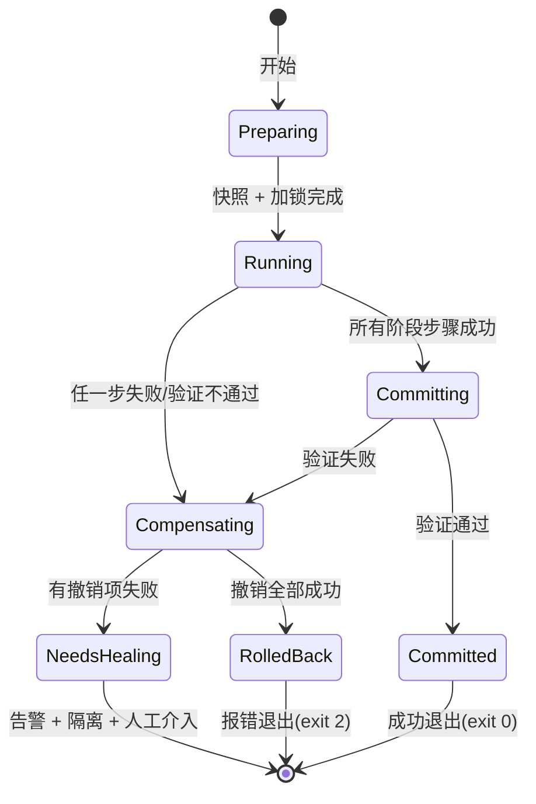

# 全局事务与回滚补偿模型

> 一句话：**一次部署就是一个事务；任何改变环境的动作都必须自带「怎么恢复原样」的说明，否则不允许进入计划。**
>
> 这条规则听起来很强硬，但它是「回滚」这个词能否成立的唯一前提。

配套：[`DESIGN.md`](./DESIGN.md)（管线与 release 布局）、[`config.md`](./config.md)（怎么配）、[`testing.md`](./testing.md)（怎么验）。

---

## 1. 从「切回去」到「恢复原样」

常见的部署工具所谓的回滚，其实只是「把 `current` 软链接指回上一个目录」。这在下面这些场景下是不够的：

| 部署过程中改过的东西 | 只切软链接能恢复吗 |
| --- | --- |
| release 目录内容 | ✅ |
| nginx 站点配置 | ❌（conf 已经被覆盖了） |
| 环境变量文件 / `.env` | ❌（内容已经变了） |
| 服务端口 / systemd unit / compose project | ❌（端口被占、unit 已 reload） |
| 镜像 tag 指向 | ❌（远端 tag 已经更新） |
| 已经启停过的服务 | ❌（状态不再对称） |

所以正确的结构不是「记一个指针」，而是：**每一步改动前先记录「恢复这件事的自带raid」。** 回滚 = 按相反顺序执行这些撤销项。

```mermaid
flowchart TB
    subgraph FS["常见单薄方案"]
        A1["current -> v2"] --> A2["回滚：current -> v1"]
    end
    subgraph TS["事务方案"]
        B1["① 记录状态快照"] --> B2["② 写 nginx conf（撤销项：还原旧文件）"]
        B2 --> B3["③ 改 .env（撤销项：还原旧内容）"]
        B3 --> B4["④ reload nginx（撤销项：reload 回旧 conf）"]
        B4 --> B5["⑤ 切 current（撤销项：切回旧 release）"]
        B5 --> B6["⑥ 健康验证"]
        B6 -->|失败| R["逆序执行撤销项 ⑤→② 并恢复快照 ①"]
    end

    classDef bad fill:#450a0a,stroke:#f87171,color:#fee2e2
    classDef good fill:#134e4a,stroke:#2dd4bf,color:#ccfbf1
    class A1,A2 bad
    class B1,B2,B3,B4,B5,B6,R good
```



---

## 2. 三类操作，三套规则

不是所有东西都能撤。**诚实地区分它们，比假装什么都能回滚重要得多。**

| 类别 | 特征 | 处理 | 例子 |
| --- | --- | --- | --- |
| **可补偿（compensable）** | 存在明确的逆操作 | 直接登记逆蜴作 | 写/删文件、`current` 切换、`docker compose up`（逆：切回旧 compose） |
| **快照补偿（snapshot-restore）** | 没法反向执行，但能先记下旧值再恢复 | 操作前**先快照**，回滚时还原 | `.env` 内容、systemd unit 文件、nginx conf、端口占用情况 |
| **不可补偿（irreversible）** | 做了就真的做了 | **默认禁止**；必须显式 `allowIrreversible` 才放行，并在计划里高亮 | 推送远端镜像 tag、执行数据库迁移、消息广播、发外部通知 |

**第三条是全设计的思想核心**：不可逆操作不允许悄悄混在部署里。它们要么被挪到 pipeline 之外（比如 CI 里单独一步 `dp migrate`），要么显式声明并承担「回滚到不了这里」的后果。

`plan()` 会对每一步打 `unwind` 标记：

```ts
type Step = {
  /* ...既有字段... */
  unwind:
    | { kind: 'none' }                       // 只读幂等，无需撤销
    | { kind: 'compensate'; steps: Step[] }   // 逆操作（也是 plan 结构，同样可 dry-run）
    | { kind: 'snapshot'; key: string }       // 回滚时按 key 还原快照
    | { kind: 'irreversible'; reason: string } // 需要显式允许，否则 plan 期直接报错
}
```

于是**回滚计划也是在部署开始前就算出来的** —— 这继承了 `plan()` 纯函数的全部好处：可以打印、可以快照测试、可以离线校验。用户可以在部署前就看到「如果失败，会按这个顺序恢复」，`dp plan --show-unwind` 就是干这个的。

---

## 3. 事务生命周期



几个设计选择：

- **`preparing` 阶段先做所有快照**，保证后面任何一步都能拿到「事前状态」。快照存在 `<root>/.dp/state/<deployId>.json`，本身也参与 atomic write
- **提交窗口越短越好**：所有能提前做好的事（上传、渲染、校验）都在 commit 之前做完，commit 那一刻只剩「换指针 + reload」这一两不可分的动作
- **`needsHealing` 是一个明确承认的状态**，不是把错误吞掉。它要做三件事：① 保留现场不继续自动操作 ② 告警说明「环境现在处于 A 部分已生效、B 部分未回滚」 ③ 打印人工可执行的下一步命令
- **exit code 要区分**：`0` 成功、`1` 部署失败但已完整回滚、**`2` 验证失败且已回滚（且经历过补偿）**、`3` 配置错、`4` 环境缺依赖 —— CI 才能针对 `2` 做不同处理（比如一定发通知）

---

## 4. 撤销的执行顺序

逆序是最直觉的，但有三条例外必须写清楚：

1. **逆序优先**，但存在依赖时按依赖反向：例如要先「切回旧 release」再「reload nginx」，因为 reloaddichotomy 的是配置文件所指的目录。所以 unwind 步骤自带 `dependsOn`
2. **并行任务的撤销要反向扇出**：集群里已发布完成的机器要先整体回退，再处理未完成的（避免半边 consistent）
3. **不可逆项不能被「逆序」跳过**：它在 plan 期就被拦下了；如果显式允许过，回滚到它时必须**停下来并告警**，而不是继续假装整个环境已恢复 —— 「部分回滚」必须被诚实报告

---

## 5. 环境/配置的恢复语义

快照内容的粒度决定了回滚能不能真的「回到原样」。每个 target 声明自己要快照什么：

| target | 快照内容 |
| --- | --- |
| 通用 | `current` 指向、release 列表、`update` 前的 `.dp/index.json`、所有将被写入文件的原 Content（或不存在这一事实） |
| nginx | 目标 conf 文件的原内容、是否被托管标记、`nginx -c` 当前生效配置版本指纹 |
| docker | compose 文件与 env、正在运行的容器列表与镜像 digest、network/volume 清单 |
| systemd | unit 文件内容、`ActiveState`、是否 enabled |
| delegate | 执行前的环境变量 contract（我们传给它的那组）与当时的 `current` 指向 |

**快照里记「不存在」和记「存在」一样重要。** 回滚时若某个 conf 原本不存在，就要删掉而不是留一个空文件 —— 这是常见的恢复 bug。

进程 hab：绝对所有恢复操作都必须先过一遍完整性校验（如 conf 校验 `nginx -t`），再生效。避免「回滚过程中把一个坏的配置写进去，导致连原来能跑的服务都挂了」——**回滚本身必须比部署更保守。**

---

## 6. 并发与事务的关系

 的并发模型：**事务是与锁同 key 的最小单位**。

- 不同 project → 独立事务，可并行，各自快照互不干扰（快照目录带 deployId）
- 同一 project → 互斥，第二个要么排队（`queue`）要么快速失败（`fail`），默认**快速失败**（并发部署同一个项目几乎总是失误）
- **持锁者已死（进程被 kill / 机器重启）**：租约到期后锁自动失效，但事务完成后不论成败都要释放锁 —— 释放必须是 `finally` 级别的，即便补偿失败也要解锁，否则这台机器就卡死了（但要把 `needsHealing` 状态写进 index）

---

## 7. 怎么验证这套事务真的成立

**故障注入矩阵**是唯一诚实的验证方式：

```ts
// L2/L3 层：对 plan 的每一步 i，注入失败，然后断言环境回到原点
for (let i = 0; i < plan.steps.length; i++) {
  it(`崩溃在第 ${i} 步后，环境必须完全恢复`, async () => {
    const env = await createSandbox(preState)
    await runWithFailureAt(env, i)          // 在第 i 步抛错 / 直接 kill 进程
    await heal(env)                         // 模拟下一次运行触发自愈
    expect(await env.snapshot()).toEqual(preState)   // 字节级一致
  })
}
```

要断言的不只是「没报错」，而是**状态字节级回到部署前**：文件 Content、符号链接指向、`.env` 内容、 Compose 状态、conf 文件内容都要一致。这一条覆盖了绝大多数回滚逻辑的真实 bug —— 尤其是「某个 ENUM_FILE 忘了恢复」这类。

配合 `--fail-at <stepId>` 的手工开关（用于真机演练），以及在 trace 里完整记录「执行到哪一步、撤销了哪些、哪些没撤掉」。

---

## 8. 一句话总结

**回滚的能力，是在 `plan()` 里被设计出来的，不是在失败时临时想的。**

每一步环境变更，在它进入计划之前必须回答三个问题：改动前头的那一刀是什么（快照）、改动之后怎么恢复（compensator）、以及它到底是不是恢复不了（irreversible）。答不上来的操作不该被执行 —— 因为失败发生时，你已经没有机会再问了。
