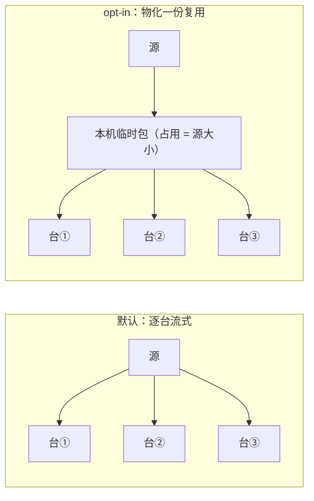
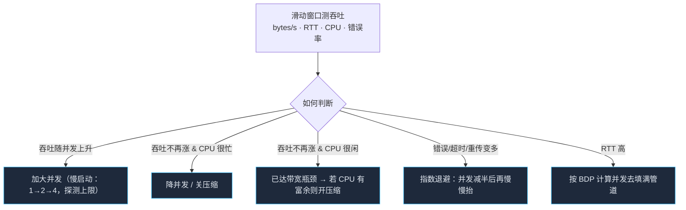

# 流式传输：不落地的上传与自适应流控

> 一句话：**本机既不打包、也不拷贝，文件从源跑着流向远端；只是因为担心把它整个读进内存或先写一份临时tar，所以我们用哈希旁路 + 有界并发 + 按测得吞吐自适应的的办法来控制开销。**

配套：[`transport.md`](./transport.md)（通道怎么建）、[`preflight.md`](./preflight.md)（事前算清空间）、[`transaction.md`](./transaction.md)（半成品怎么清理）。

---

## 1. 为什么不在本机打包

「先 tar 成一个包再传」是最自然的写法，也是最容易在别人机器上出事的写法：

| 代价 | 后果 |
| --- | --- |
| 临时磁盘 = 源大小（甚至更大） | 本机 SSD 只剩一点空间就直接失败；CI 容器常常只有几 GB |
| 内容要读两遍、写一遍 | CPU 与磁盘 I/O 翻倍，总耗时不是「传的时间」而是「打包 + 传」 |
| 失败时留下的垃圾最大 | 一个几十 GB 的半成品 tar，回滚清理都要时间 |

结论：**默认一律流式：读一点、算一点、传一点。** 只有一种情况例外 —— 同一个产物要发给很多台机器时。

### 多主机扇出时的例外策略

给 N 台机器发同样的大产物，有两种选择：



默认走 A：多读几次源通常比占用一份与源等大的磁盘便宜。**只有当用户显式配 `transport.materialize: true`，且预检确认空间足够时才走 B**，而且必须在输出里说明「本次会占用本机 X GB 临时空间」。

> 这也解释了为什么 releaseId 必须边传边算：我们没能先读一遍内容算哈希，所以要把它挂到流的旁路。

---

## 2. 流水线


三个要点：

1. **walk 只读元数据**（`stat`），这一步必须做：我们要知道文件清单才能算 releaseId、才能做 preview、才能给进度条分母
2. **内容只读一次**，哈希挂在流旁路上（一个 Transform 流），不在传之前单独扫一遍
3. **远端顺序敏感**：多层 read/write 必须用 `pipe()` 而不是手动 data 事件，靠 Node 的背压把内存压在 O(并发 × chunk) —— 不是 O(总大小)

### releaseId 怎么办：边传边算 + 最后 rename

```
releases/.incoming/<tmpId>/   ← 流式写入目标（同分区！）
       │ 全部传完、算出 contentHash
       └─ rename → releases/<yyyyMMdd-HHmmss>-<contentHash[0..8]>
```

两个前提：**`.incoming` 必须与 `releases` 在同一文件系统**（否则 rename 不是原子的），以及 **改名前必须完成完整性校验**。这也回答了「传了一半怎么办」——清理 `.incoming/<tmpId>` 就行，永远不会有半截的正式 release 存在。

---

## 3. 多小文件 vs 单个大文件

两种极端要不同的对策，中间地带由启发式规则决定：

| 形态 | 瓶颈 | 对策 |
| --- | --- | --- |
| **海量小文件**（几万个小 progenitor） | 每文件握手/元数据往返 | 用 tar-ssh 消除逐文件往返；sftp 场景开**并发 N** 并复用同一个会话；不要为每个文件单独开 exec |
| **单个巨文件**（GB 级镜像/包） | 单条流撑不满带宽、断一次要重来 | 若能协商出 rsync → **首选**（它天生支持断点续 diff）；否则 sftp 做**位置式续传**；tar 流不提供续传（重跑即全传） |
| 混合（大部分体积集中在大文件） | 两类问题同时存在 | 先按体积降序排，大文件优先早开、小文件并发铺满 |

启发式（可在传输前对文件清单算出来，纯函数、可测）：

```
avgSize < 64KB 且 count > 1000      → 小文件模式：并发优先，禁用逐序号等待
maxFileSize > totalSize × 0.5       → 大文件模式：优先 rsync（可续传），否则 sftp 续传
两者都不是                          → 自适应模式（默认）
```

---

## 4. 自适应流控

本机 CPU、磁盘吞吐、带宽、对端能力，任意一个都可能短板。所以**参数不能写死，要按测得的吞吐自调整**。

三个可调旋钮：`concurrency`（并发文件数/管道数）、`compression`（压缩开关与级别）、`bandwidthLimit`（带宽上限，兜底用）。



**带宽时延积（BDP）给出的并发起点**：

```
目标并发 ≈ 带宽(bytes/s) × RTT(s) / chunkSize(bytes)
```

比如 20MB/s、RTT 60ms、chunk 64KB：`20×10⁶ × 0.06 / 65536 ≈ 18`。所以别定死 4 或 8 ——快网这数太小，慢网又太大。

还要**用对端能力给并发封顶**：Facts 里有远端 CPU 核数与内存，一台 1 核小机器被 16 路并发写会把它的 iowait 打满，验收阶段反而超时失败。所以 `maxConcurrency = min(本机上限, 远端核数 × 系数, BDP 估算)`。

| 观察 | 动作 |
| --- | --- |
| CPU 忙而吞吐低 | **关压缩**（压缩是最常见的本机瓶颈）、降并发 |
| CPU 闲而吞吐顶到带宽 | 尝试开压缩（丢 SSH 层不可见时不适用 —— 已加密内容压不动，此时压缩纯属浪费） |
| 吞吐突然掉到很低 | 可能是传输挂起：设定停滞超时（N 秒无进展即判定失败） |
| 错误率上升 | 退避，不要硬拷 |

> 一个容易忽略的事实：**SSH 层已经加密，通用压缩几乎无效**；此时 `compression` 应该默认关闭，只对明文変換。默认取值：`adaptive` 会先试一小段判断压缩率是否有收益，没收益立刻关闭。

---

## 5. 失败、重试与续传

| 场景 | 处理 |
| --- | --- |
| 单文件传错 | 记入重试队列；同一内容重传是幂等的（先落临时名再 rename） |
| 连接断开 | SSH 链重建；已确认写入的文件跳过（用校验清单判断） |
| 大文件传到一半 | rsync 天然续传；sftp 走位置续传（记录已传字节，下次从该偏移写） |
| tar 流断掉 | **不可续传**：清理 `.incoming` 后整段重来 —— 这就是为什么大文件场景要优先协商 rsync |
| 区块/校验不符 | FAIL，不做「尽力保留」——多数情况下，传一个写坏的文件比不传更危险 |

每次进入传输前先看一下 `.incoming` 里有没有陈旧的半成品：按 TTL 清理，但**绝不清理 current/previous 指向的目录**（见 transaction.md 的自愈规则）。

---

## 6. 可观测

进度必须能一眼看出「卡在哪里」：

```
web → prod-01    ▓▓▓▓▓▓▓░░░░  62%  1,842/2,980 files   38.4 MB/s   并发 12   压缩 off
                 剩余 ≈ 00:14    ← 大文件 node_modules.tar.gz（已传 340MB/980MB）
```

- 进度、吞吐、当前并发、压缩状态都是**一行可刷新**（TTY 用 `\r`，非 TTY 节流输出；CI 用 `--json` 输出结构化事件）
- **决策要写进日志**：`本机 CPU 90%，检测到 CPU 瓶颈 → 关闭压缩（原 heated 12MB/s，现 18MB/s）`
- trace 里记录最终参数，下次可以作为**初始值**（简单地省掉一次慢启动）

---

## 7. 配置

```yaml
transport:
  strategy: auto
  stream: true            # 默认真流式；false 时仍需 materialize:true 才落地 temp
  materialize: false      # opt-in，预检必须先确认空间
  concurrency: auto       # auto | 1..64
  compression: adaptive   # off | on | adaptive
  chunkKB: 64
  bandwidthLimit: '20m'   # 兜底限速
  resume: auto            # auto | off | force（按策略是否支持续传）
  stallTimeoutMs: 60000
  maxMemoryMB: 128        # 缓冲上限，超出即降并发而不是 OOM
```

---

## 8. 怎么验

这一层最值得测的是「它在差环境下会不会垮」：

| 测试 | 断言 |
| --- | --- |
| **不留临时文件** | 监视本机 tmp 与项目目录，断言全过程中没有产生 > chunk 的临时文件（这是本设计的第一承诺） |
| **内存有界** | 传 2GB 数据，采样堆峰值 < `maxMemoryMB + 余量` |
| **断 slow sink** | 假远端只以 1MB/s 消费：断言本机不预读、不做无谓缓冲、吞吐跟随消费者 |
| **中断续传** | 强制在 30% 处断链（sftp/rsync 两种），重跑后实际传输字节 < 全量的一半 |
| **自适应决策** | 注入「CPU 忙」信号，断言日志出现关闭压缩/降并发的决策，且总耗时优于不调优的实现 |
| **内容一致** | 各种随机文件树 → 传完比对远端与源字节一致（`fileCount × sizeClass` 矩阵） |

前两条是硬承诺：**本机资源受限是这个设计假设的前提，所以它必须是可被断言的，而不是只能靠感觉。**
