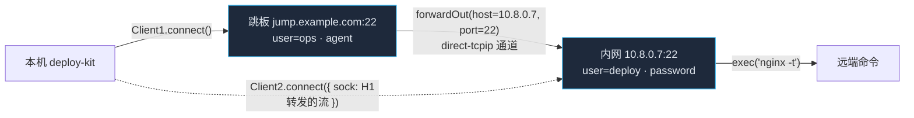
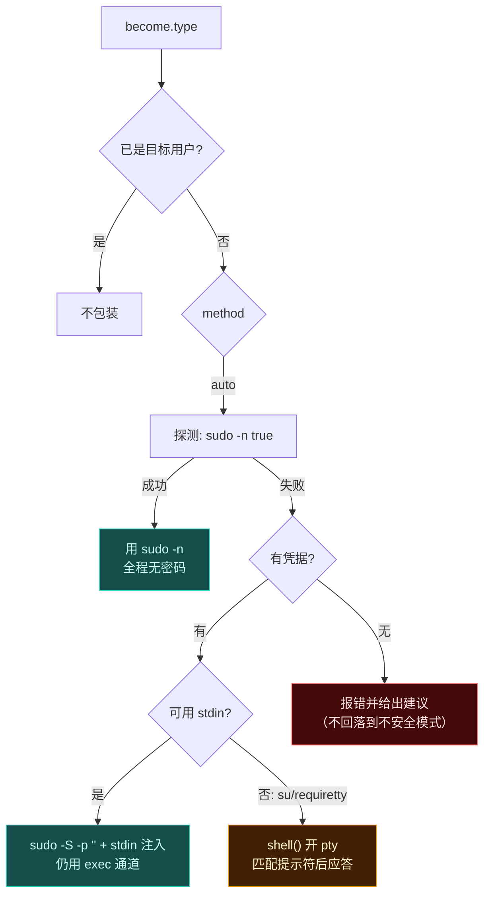
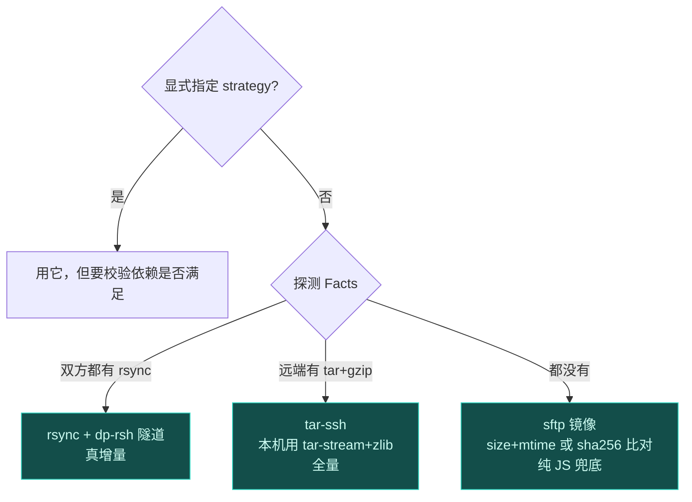

# 传输层设计：多跳、提权、无 sshpass、rsync 自建隧道

> 一句话：**自己当 SSH 客户端，是为了把「认证」「多跳」「提权」「传文件」四件事统一到一个抽象里 —— 而这四件事用系统 ssh 做，每一件都要付出一个不一样的代价。**

配套：[`DESIGN.md`](./DESIGN.md) 讲分层，[`security.md`](./security.md) 讲密码学与凭据策略，[`config.md`](./config.md) 讲这些怎么填进配置。

---

## 0. 约束倒推形态

先在脑子里确认一遍我们到底被什么限制住（实测环境）：

| 约束 | 实测 | 倒推出来的结论 |
| --- | --- | --- |
| 没有 `sshpass` | ✅ 确认不存在 | 不能靠喂 TTY 给二进制 ssh；**认证必须在协议层做** |
| 有 `ssh` 二进制（OpenSSH 10.3） | 验证环境有 | 但它不该是必选项：别人的 CI / Windows 上没有，且版本参差 |
| 目标可能在跳板机后面 | 需求给定 | 每跳要能独立认证、独立 crypto 协商 |
| 普通用户要 su/sudo | 需求给定 | 需要能处理交互式提示符，而不是只会跑非交互命令 |
| 想用 rsync | 需求给定 | rsync 默认 `--rsh ssh`；要么给它一个假 ssh，要么不用系统 ssh 就享受不到增量同步 |

四条加起来的唯一交集：**用纯 JS 的 SSH 客户端（`ssh2`），并且让 rsync 通过我们自己的 remote-shell 助手通信。**

顺带一个好处：`ssh2` 包含了 **SSH 服务端实现**，于是我们能起「假 SSH 服务器」做全套集成测试 —— 这是本项目测试能力的最大来源，见 [`testing.md`](./testing.md)。

> 顺手记一笔依赖事实：`ssh2@1.17.0` 的可选依赖是 `cpu-features` 与 `nan`（都需本地编译）。pnpm 10+ 默认阻断构建脚本，所以要么在 `pnpm-workspace.yaml` 的 `onlyBuiltDependencies` 里加这两个，要么**更推荐**：安装时跳过可选依赖（它们只影响默认 cipher 顺序的性能择优），本机 CPU 特性探测缺失不影响功能。

---

## 1. Runner 端口：整个系统的地基

```ts
interface Runner {
  readonly id: string
  probe(force?: boolean): Promise<Facts>
  exec(spec: ExecSpec): Promise<ExecResult>          // one-shot exec channel，有 exit code
  streamExec(spec: ExecSpec): Promise<StreamHandle>   // 需要喂 stdin 的场景（tar / docker load）
  shell(opts?: PtyOptions): Promise<ShellSession>     // 交互式会话（提权、su）
  fs: RemoteFs                                        // read/write/stat/mkdir/symlink/readlink/remove
  close(): Promise<void>
}
```

三条纪律：

1. **`exec` 是默认通道**，因为它有独立的 stdout/stderr 与真实退出码。
2. **`shell` 只在该用的时候用**：需要 tty（强制性鑒权提示符、`su`）或需要复用一次提权结果时。
3. **`Runner` 不暴露 ssh 概念**。上层永远不知道对面是本机子进程还是三跳之外的机器 —— 这条被 ESLint 的 import 规则守着。

本地目标是这个接口的另一个实现（`@dp/local`）：`exec` 用 `child_process.spawn`，`fs` 用 `node:fs`。**它的存在本身就是对这个接口是否合理的检验。**

---

## 2. 认证：为什么不需要 sshpass

sshpass 解决的是「OpenSSH 二进制只肯从 TTY 读密码」。用 `ssh2` 时，密码是作为 `authHandler` 的一个分支在协议里发的：

| 认证类型 | 用在哪 | 注意 |
| --- | --- | --- |
| `key` | 首选；支持加密私钥的 passphrase | 私钥读自文件或内存，**不落临时文件** |
| `agent` | 本机跑着 ssh-agent 时 | 默认**不做 agent forwarding**（跨跳板时等同于把钥匙交给中间机器，见 security.md） |
| `password` | 老设备、没法发 key 的场景 | ssh2 直接支持，无需 sshpass |
| `keyboard-interactive` | 很多设备表面是 password、实际只接受 kbdint | **自动兜底**：`password` 失败后必须尝试 kbdint。这是 sshpass 用户最常见的卡点，我们默认处理掉 |

**认证顺序要显式，不靠库的默认值。** 库的默认顺序会先试 `none` 再 `password` 再 `publickey`，在有些设备上会先触发密码失败计数。我们按配置顺序走（`auth.order`），没配就用安全默认：`agent → key → password → keyboard-interactive`。

凭据统一以 `passwordRef` / `passphraseRef` 形式给（`env:` / `file:` / `prompt:` / `cmd:`），见 security.md。**密码只在 SSH 流里出现一次，不进 argv、不进环境变量、不进临时文件。**

---

## 3. 多跳：hop chain 怎么搭起来

目标不是「连到跳板机再 exec」，而是让**每一段连到下一段的 TCP 流**都由前一段的 SSH 隧道承载 —— 也就是 OpenSSH `ProxyJump` 干的事。



实现骨架（约 200 行，比想象中少）：

```
sock₀ = net.connect(hop[0].host, hop[0].port)
for i in hops:
    client[i] = new Client()
    await client[i].connect({ sock: sock_i, ...auth_i })
    if (i < last) sock_{i+1} = await forwardOut(client[i], hops[i+1].host, hops[i+1].port)
```

必须解决的六个细节：

1. **每跳独立的主机密钥校验**。第 2 跳不能继承第 1 跳的信任；失败时要报 `hopIndex` + 期望指纹 + 实际指纹。
2. **每跳独立的 crypto 协商**。这是最容易被忽略的一条：**连接只在两跳之间协商，整条链的强度等于最弱的一段**。中间跳板如果是老 SSH，即使两端都支持 ML-KEM，链上仍有非抗量子的段 —— 所以抗量子策略要**逐跳上报**，见 security.md。
3. **逆序关闭**。先关最内层再关外层，不然留孤儿通道和半开 TCP。
4. **保活**。每跳定期发 keepalive 保活；有的 NAT 十秒不说话就断。
5. **超时逐跳配置**。对外网跳板给 15s，内网给 5s，别用一个全局值。
6. **跳板只允许 port-forward 时怎么办**。有些 bastion 禁止 exec 只允许转发 —— 这是正常情况，本来就该如此（我们本来也只在最后一跳 exec）。要报错的是「连转发都不给」。

---

## 4. 提权：把「怎么包装」和「怎么喂密码」拆开

这是最容易写糊的一块。先认清一件事：提权其实是**两个正交问题**。

| 问题 | 回答 | 例子 |
| --- | --- | --- |
| **包装（wrap）**：命令行变成什么样 | `wrap(argv) → argv` | `sudo -S -p '' <cmd>`、`su - root -c '<cmd>'` |
| **投喂（fulfill）**：提示符出现时怎么答 |  responder 策略 | stdin 注入 / pty 应答 / 无需作答 |

组合起来才是完整方案：

| `become.type` | 包装 | 能否 stdin 投喂 | 备注 |
| --- | --- | --- | --- |
| `none` | 不包 | — | 已是目标用户时的正解 |
| `sudo` | `sudo -n`（NOPASSWD）或 `sudo -S -p ''` | ✅ `-S` 从 stdin 读 | 首选。默认先探测 `-n` 能不能成，能成就**完全不需要密码** |
| `su` | `su - <user> -c '<cmd>'` | ❌ 只能走 pty | su 通常拒绝非终端读密码，且要吃一次**双层引号**，最容易写错 |
| `doas` | `doas -n` / `doas -a` | ✅ | BSD 系默认策略不同（`doas -n` 不一定可用），要探测 |
| `custom` | 用户给模板，含 `${cmd}` 占位 | 视模板 | 覆盖流程图上没画到的奇异版本（`dzdo`、`pbrun` 之类） |

### 顺序决策流水线



### 三个容易踩的坑

1. **`su` 的双层引号**。命令要先按 shell 语义转义，才能塞进 `su -c '...'` 的单引号里；此时用户输入里的单引号要变成 `'\''`。这就是为什么 `quote()` 必须是**唯一出口**且要有属性测试（随机串 → quote → 反解析 → 原串），见 testing.md。
2. **密码错误的识别**。连/ssh 到 end 才超时是不够的：必须同时匹配失败信号（`Sorry, try again`、`su: Authentication failure`、`sudo: 3 incorrect password attempts`），立刻报错而不是等超时。
3. **凭据缓存**。提权一次问一次密码会让人抓狂。策略：当 `become.type` 需要 pty 时，整个部署复用**同一个 shell 会话**（warm session）直到结束，<｜hy_place▁holder▁no▁813｜>情况下才每步 exec。这个决策要在日志里说清楚：「本次复用一个提权会话」。

### 安全边界

- 提权凭据**只写到 SSH 通道流**，不落到命令行参数（`sudo -S` 从 stdin 读正是为此）、不写临时文件
- 默认不提供 `-E`（不保留用户环境变量），除非显式开 `become.preserveEnv` —— 否则 `LD_PRELOAD` 之类会跟着过去
- 审计建议（写进 `--audit`，不自动改用户机器）：给出一条**最小化的 sudoers drop-in** 建议片段，把命令收敛到部署必需的几条

---

## 5. 执行通道的三种形态

| 形态 | 什么时候用 | 代价 |
| --- | --- | --- |
| `exec` channel | 绝大多数命令 | 无 tty；拿得到 exit code；stdout/stderr 分离 |
| `shell` session（pty） | `su`、`requiretty` 的 sudo、需要复用一次提权 | 有 tty 副作用（颜色、换行转换、进度条刷屏）；**退出码要从标记行里取** |
| `streamExec` | 喂 stdin：`tar -xzf -`、`docker load` | 要小心背压与提前关流的错误吞掉 |

pty 场景下拿不到原生退出码，标准做法是在命令后追加一行 **哨兵**：

```
... ; echo "__DP_EXIT=$?__"
```

然后在输出里扫哨兵行。哨兵串必须随机化（每次会话生成），否则远端命令回显里偶然出现同名会被误判。

---

## 6. rsync：给它一个我们自己的 ssh

rsync 增量同步这件事不重造（协议复杂），但传输通道要换掉。做法不是放弃 rsync，而是**替换它的 remote-shell**。

### 契约

rsync 的手册里写得很清楚：`-e, --rsh=COMMAND` 允许指定替代的远程 shell，**且 COMMAND 可以带参数**（必须作为单个参数整体传给 rsync），环境变量 `RSYNC_RSH` 同样生效。调用形态大致是：

```
<rsh 命令> [rsh 参数] <host> rsync --server <选项> . <路径>
```

也就是说，我们的助手会拿到「目标主机」和「远端要跑的 rsync server 命令」两件事，剩下的只是**把本机的 stdin/stdout 接到远端那条命令的标准输入输出上**。

### dp-rsh 助手怎么工作


1. 主进程起一个本机 IPC 端点（localback TCP 随机端口 + 随机 token，或 Windows 命名管道），把地址放进**只给 rsync 子进程的环境变量**
2. rsync 用 `-e "dp-rsh"` 启动，助手从环境变量拿到 IPC 地址
3. 助手把自己要执行的命令（含 `--server` 参数与提权包装）发给主进程
4. 主进程在已有的 SSH 链上 `exec` 那条命令，并把通道与助手的 IPC 连接对接
5. 助手把自己的 stdin/stdout 与 IPC 连接**裸字节**互通，**不做任何换行转换或缓冲**

**为什么不放 argv？** 因为 `ps` 能看到命令行，同机其他用户就看到了凭据或目标内网地址。走环境量 + IPC，token 只存在于父子的环境里。

### 需要在 spike 里先验证的四件事

1. rsync 调用自定义 rsh 时的 **argv 精确顺序**，特别是目标写成 `user@host` 时 rsync 会不会自作主张插入 `-l user`
2. `--protect-args` 与远端内含空格的参数是否需要纠偏
3. Windows 上没有 rsync 时如何**干净地降级**（本机没有 rsync 二进制不是错误，是常态）
4. 助手与主进程的 IPC 在子进程的生命周期上有没有粘滞（rsync 可能 fork/exec 多次）

配套的另两个开关：

- `--rsync-path="sudo rsync"`：远端 rsync 需要提权时用；但我们也可以直接用 `become.wrap()` 包装整条 server 命令，二者等价，选择权交给配置
- `transport.delete`（`--delete`）默认关：往一个不是我们管理的目录做删除是不可接受的默认行为

---

## 7. 没有 rsync 的时候

自动协商，顺序如下 —— 每一步的选择都要写进日志和 plan，不要默默变慢：



| 策略 | 增量 | 保留权限/软链接 | 备注 |
| --- | --- | --- | --- |
| `rsync` | ✅ 差量传输 | ✅ | 最快，前提是两端都有 |
| `tar-ssh` | ❌ 全量 | ✅ | 本机不依赖 rsync，跨平台最好用；缺点是每次全传 |
| `sftp` | ✅ size/mtime（可选 sha256） | ⚠️ 部分 | 只需要 sshd；权限/软链接要在各环节单独补 |

**协商必须是显式可见的**：日志里应该写「本次使用 tar-ssh：本机未检测到 rsync」。用户有权知道为什么这次比上次慢。

---

## 8. Facts：一次探完，别一问一答

多跳环境下每次 `exec` 都要穿整条链，所以探测必须**合并成尽量少的往返**：

```sh
# 一条复合脚本，输出结构化片段后被解析成 Facts
printf '%s\n' \
  "$(uname -s) $(uname -m) $(id -un) $(id -u)" \
  "$(command -v rsync || echo -) $(command -v tar || echo -)" \
  "$(sudo -n true 2>/dev/null && echo sudo-nopass || echo sudo-no)"
```

然后客户端用一个小的解析层把它变成 `Facts`（并过一层 zod 校验 —— 远端返回怪东西应该报错而不是猜）。

`Facts` 的三个来源：真探测 / 缓存文件（`--facts facts.json`）/ 测试夹具。**`--facts` 让 `plan` 在连不上任何机器的 CI 里也能跑** —— 这是 plan 纯函数设计的直接收益。

---

## 9. 错误、超时与重试

| 场景 | 行为 |
| --- | --- |
| 认证失败 | `AUTH_FAILED` + hopIndex + 用过的认证方式，**不自动换方式重试超过一次**（试多了会触发账户锁定） |
| 主机密钥不匹配 | `HOST_KEY_MISMATCH`，**永不自动放行** |
| 缺工具 | `TOOL_MISSING` + 建议（「可指定 transport.strategy: tar-ssh」） |
| 提权失败 | `ELEVATION_FAILED` + 远端原话片段（脱敏后） |
| 命令超时 | kill 通道 + `TIMEOUT`，重试只对**幂等步骤**开启（非 idempotent 的步骤不允许自动重试） |
| 连接中断 | 链整体重连；正在执行的步骤按 `idempotent` 标记决定是否可安全重试 |

最后一条是关键：**重试的前提是这个步骤重试一次还是安全的**。这也解释了为什么每个 Step 都要带 `idempotent` 标记 —— 它不是注释，是重试策略的输入。
