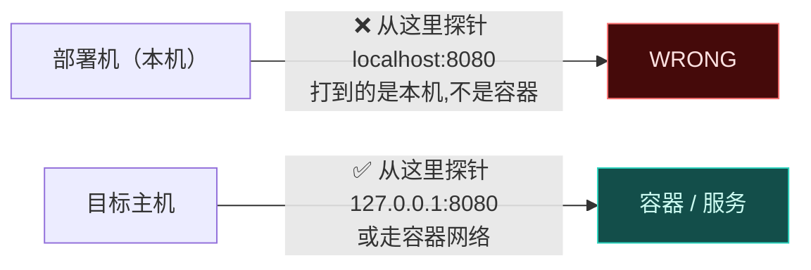
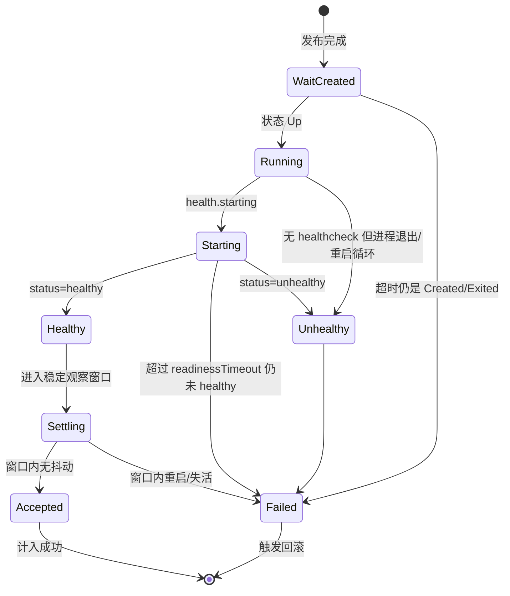
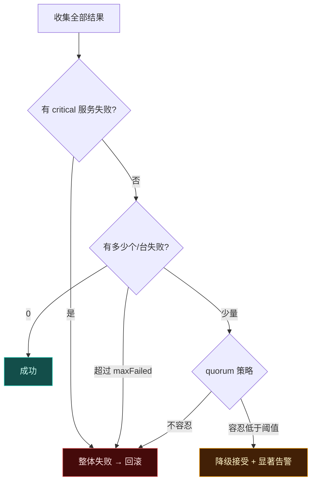

# 健康检查与验收决策

> 一句话：**「容器起来了」和「服务可用了」是两件事；发布是否成功，由验收阶段裁定，而不是由启动命令的退出码裁定。**

配套：[`transaction.md`](./transaction.md)（验收失败触发全局补偿回滚）、[`config.md`](./config.md)（怎么写 `healthcheck`）。

---

## 1. 先看三个真实的失败形态

| 现象 | `docker compose up` 的退出码 | 真实情况 |
| --- | --- | --- |
| 容器秒退（`Exited (1)`） | 可能仍是 0（用了 `-d`） | 服务完全没起来 |
| 容器在**重启循环**里反复崩 | 看起来 `Up (health: starting)` | 配置错 / 依赖没就绪 / 卷没挂上 |
| 进程在跑但listen 还没就绪 | `Up` | 此时切流量过去就是雪崩 |

所以启动命令的成功只代表「命令发出去了」，验收必须独立存在 —— 它回答的是：**这个新版本能不能承受流量。**

---

## 2. 探针必须在哪台机器上跑（最容易搞错的一点）

这是个原则性问题，而不是实现细节：



**HTTP/TCP 探针一律通过 `Runner` 在目标主机上执行**，探针地址里写 `127.0.0.1` 指的就是目标主机的回环。这是把「健康检查」做成 plan 里的一步、而不是在本机上直接探测 —— 因为 plan 天然带着 `where: local | remote`。

两个例外要说清楚：

- 需要**从外部**验证（比如公网 HTTPS、CDN、从另一个机房访问）的探针，显式标 `from: external`，这时它确实从部署机发起
- 需要在**容器网络内部**探测时，用 `docker compose exec <service> <cmd>` 或 `docker run --rm --network <net> probe` —— 走的是同一条 Runner 通道

---

## 3. 探针类型

| 类型 | 干什么 | 关键参数 |
| --- | --- | --- |
| `container` | 容器/服务诘问状态（`State.Status`、`State.Health.Status`、重启次数） | `expectStates`、`allowQualifiedNames`、`minUptimeMs` |
| `http` | HTTP 请求 | `url`、`expectStatus`、`expectBody`、`headers`、`insecure` |
| `tcp` | 端口连通 | `host`、`port`、`timeoutMs` |
| `command` | 任意命令（`nginx -t`、`curl`、自己写的脚本） | `run`、`expectExit`、`expectStdout` |
| `fileExists` | 关键文件已就位 | `path`、`minSizeBytes` |
| `mount`（容器专属） | 校验数据卷挂载是否符合预期 |  |

所有探针统一带：超时（严格小于发布超时）、重试次数与退避、以及**失败时的取证动作**。

---

## 4. 容器验收状态机

单个容器的判定不是二值，而是一个带时间的过程：



四条必须落地的判定规则：

1. **`starting` 不是成功也不是失败**，要在这个状态下轮询直到 `healthy` 或超时。把它直接判成功，就是发布完立刻雪崩的经典原因
2. **重启循环是失败信号**：在窗口内 `RestartCount` 增长 ≥ `restartFailThreshold`（默认 2）立即判失败 —— 不必等超时
3. **没有 healthcheck 的容器不能算「健康」**：只能算「在运行」。这时要么用 `http`/`tcp`/`command` 补探针，要么显式 `acceptWithoutHealthcheck: true`（并且要在 trace 里标注这次验收强度较弱）
4. **稳定精神攻势（optional settle）**：`settleMs` 窗口内不允许重启或失活。有些问题是「起来正常、三十秒后 OOM」，第一轮的 healthy 骗过了很多人

---

## 5. 容器专属校验清单（数据卷 / 端口 / 镜像）

「容器起来了但数据卷没挂对」是最隐蔽的生产事故之一 —— 一切正常，只是数据写到了别处或重启就丢。验收阶段要主动查：

| 校验 | 检查什么 | 常见错误 |
| --- | --- | --- |
| **挂载点** | `docker inspect` 的 `Mounts` 与 compose 声明逐项比对：源路径存在、`RW` 正确、目标路径正确 | 相对路径被解析成空目录；宿主机路径不存在时 docker 会**静默创建一个空目录** |
| **命名卷** | 卷存在且被正确引用 | 卷名拼错 → 又是一个空卷，旧数据看起来「消失了」 |
| **数据非空性** | 关键目录里是否有预期文件 | 挂载覆盖导致文件不可见 |
| **端口绑定** | `NetworkSettings.Ports` 与期望一致 | 端口冲突导致实际没绑上，或被旧容器占着 |
| **镜像版本** | 运行中容器的 `Image` digest == 本次构建/推送的 digest | 远端还在用缓存的旧镜像，**「发布成功」但代码没变** |
| **资源限制** | `Memory`/`CPU` 是否按预期 | Compose 覆盖文件没生效 |
| **SELinux 标签** |`:z` / `:Z` 是否正确 | RHEL 系上权限被拒，写不进卷 |

最后那条「镜像 digest 校验」值得单独强调：**容器起来了 ≠ 跑的是你刚构建的那个镜像。** 少了这一步，整个 CI 可能都在假发布。

---

## 6. 多容器 / 多主机怎么裁决



配置形态：

```yaml
projects:
  api:
    rollout:
      strategy: rolling
      batch: 1
    verify:
      quorum: '>= 80%'          # 允许少量豁免（集群有冗余时）
      criticalServices: [api, worker]   # 这些失败就是整体失败
      readinessTimeoutMs: 60000
      settleMs: 30000
      maxFailed: 0              # 默认零容忍
      onFailure: rollback       # rollback | investigate | accept-warn
    healthcheck:
      - { type: container, service: api, expectStates: [healthy], minUptimeMs: 5000 }
      - { type: container, service: gateway, expectStates: [healthy, running], acceptWithoutHealthcheck: false }
      - { type: mount, service: gateway, expectMounts: [{ source: '/srv/uploads', target: '/app/uploads', rw: true }] }
      - { type: image, service: api, expectDigestFrom: build }    # 校验跑的就是刚构建的镜像
      - { type: http, url: 'http://127.0.0.1:8080/healthz', expectStatus: [200,204], retries: 10, backoffMs: 2000 }
```

要点：

- **`criticalServices` 让「部分成功」这件事变得可控**，而不是靠阈值的算术
- **`quorum` 只用于确有冗余的集群**；默认 `maxFailed: 0` —— 零容忍才是安全默认
- **`onFailure: investigate`** 保留现场不回滚（便于排查），但必须同时给出「怎么手动回滚」的命令 —— 不能留下一个没人知道怎么收拾的现场

---

## 7. 失败时的取证

回滚之前先把证据拿到手，否则回滚完就再也复现不了了：

| 取证动作 | 内容 |
| --- | --- |
| 容器日志 | 最近 N 行（默认 200），**过脱敏**后写进 trace |
| 容器 inspect | 状态、 mounts、重启次数、退出码、环境变量键名（不含值） |
| 失败探针的原始输出 | 含 HTTP 状态码、响应片段（截断） |
| 系统侧 | `df -h`（磁盘满是很常见的一条容器启动失败原因）、内存、时间同步 |
| 宿主机服务日志 | nginx/systemctl 的 `journalctl -n` 片段（按权限允许时） |

取证要：**快（有超时）、小（有截断上限）、脱敏（过 Logger 的 sink）**。因为回滚会销毁现场，这一步是唯一的机会。

---

## 8. 与事务的关系

验收（verify）是事务里唯一能决定「提交还是补偿」的阶段：

- 全部通过 → `committing → committed`，清理旧版本
- 任一失败 → 进入 `compensating`，按 [`transaction.md`](./transaction.md) 的逆序撤销 —— 包括把容器回滚到旧 compose/旧镜像
- 取证失败不应阻断回滚，但要记录（否则为了取证把回滚卡住是本末倒置）

最后一句原则：**验收集合的服务越来越多（容器、进程、HTTP、外部观测），但它永远是同一个东西 —— 一个回答「能不能继续」的纯函数**（给定观测结果，输出 accept / reject / warn）。判定逻辑保持纯函数，就能像 `plan()` 一样做矩阵快照测试：给一组观测，断言裁决结果。
